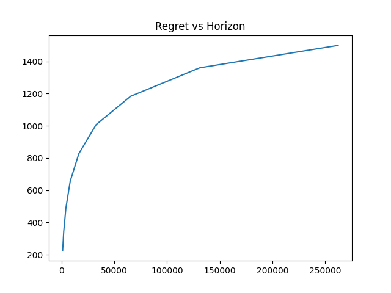
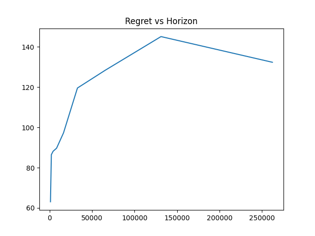
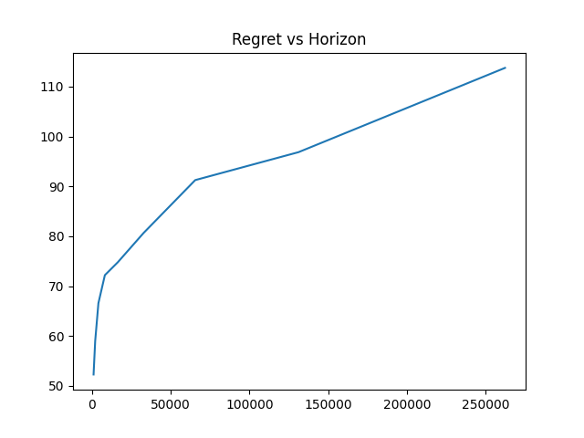
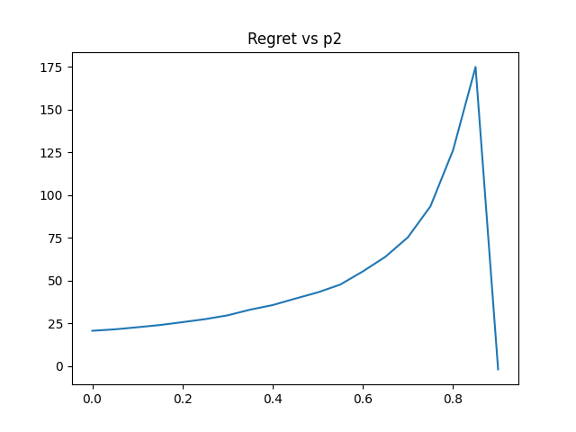
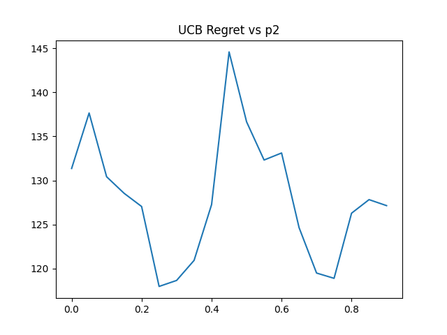
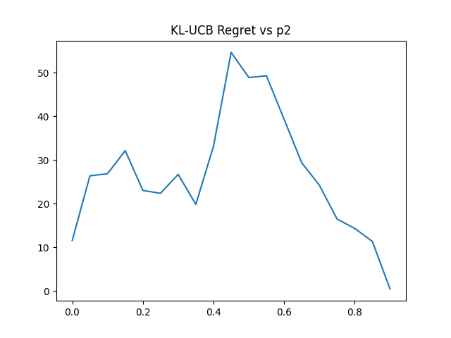
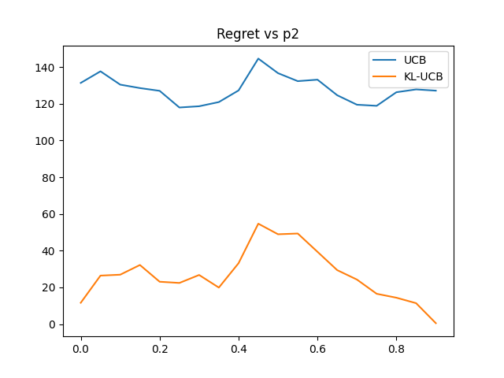

## Task 1

### UCB

|Plot|
|---|
||

The UCB algorithm works by pulling the arm $a$ at iteration $t$ which maximizes the following,
$$
  \text{ucb}_a^t = \hat p_a^t + \sqrt{\frac{2\ln(t)}{u_a^t}}
$$

The required emperical means $(\hat p_a^t)$ and count of pulls $(u_a^t)$ are computed in the variable `values` and `counts` respectively in the same way as done for the epsilon greedy algorithm. For $t$ another variable `total_pulls` is stored and incremented on every call of `get_reward`. The arm to be pulled is chosen by finding $\argmax_a\text{ucb}_a^t$.

### KL-UCB

|Plot|
|---|
||

The KL-UCB algorithm works by pulling the arm $a$ at iteration $t$ which maximizes the following,
$$
  \text{ucb-kl}_a^t = \max\\\{q\in[\hat p_a^t,1]:u_a^t\text{KL}(\hat p_a^t, q)\le \ln(t)+c\ln(\ln(t))\\\}
$$
where for Bernoulli distributions,
$$
  \text{KL}(p,q) = (1-p)\log\left(\frac{1-p}{1-q}\right) + p\log\left(\frac{p}{q}\right)
$$

The variables `counts`, `values` and `total_pulls` from UCB are reused. While implementing $c$ is taken to be 0. To find the optimal $q$ for each arm, a vectorized version of the binary search algorithm is implemented with numpy. The $q$ found has a maximum precision of $10^{-2}$. The arm to be pulled is chosen by finding $\argmax_a\text{ucb-kl}_a^t$.

### Thompson Sampling

|Plot|
|---|
||

The Thompson Sampling algorithm works by selecting arm $a$ at iteration $t$ with the maximum draw from beta likelihood distributions given by,
$$
  x_a^t\sim\text{Beta}(s_a^t+1, f_a^t+1)
$$ 

The success and failure counts, $s_a^t$ and $f_a^t$, are stored in the vectors `succeses` and `failures` respectively and updated during the `get_reward` call. The arm to be pulled is chosen by drawing a vector from the numpy's beta distributions with proper parameters and picking the arm with highest drawn value.

## Task 2

### Part A

|Plot|
|---|
||

The above plot clearly shows that in the described 2-arm bandit instance, as $p_2$ varies from 0 to 0.9 with $p_1$ fixed at 0.9, the regret rapidly rises and finally becomes 0.

This can be explained by the observation that as $p_2$ increases it becomes more and more difficult to tell the two arms apart. For UCB algorithm as shown in class,
$$
  \text{Regret}_T = \mathcal{O}\left(\frac{1}{p_1-p_2}\log(T)\right)
$$
From this bound we can infer that the plot follows a rectangular hyperbola with asymptotes at $p_2=p_1$ and $\text{Regret}=0$. When $p_2=p_1$, it makes sense that the regret is 0 as both arms are the correct choice.

### Part B

|UCB|KL-UCB|
|---|---|
|  |  |

In the plot shown below we can see that the regret from KL-UCB algorithm is roughly a fraction of the regret from UCB algorithm.

This agrees with what we had seen in class that both algorithms are able to get asymptotically logarithmic regrets but differ by a constant factor, KL-UCB being the one to achieve optimal regret of the Lai-Robbins lower bound.

|Comparison|
|---|
||

## Task 3

In the faulty multi-arm bandit instance, for an arm with Bernoulli parameter as $p$ (without fault) and fault probability $q$, the probability of getting 1 reward is,
$$
  P(1;p,q) = (1-q)\cdot P_{\text{bernoulli}}(1;p) + q\cdot P_{\text{uniform}}(1;\\\{1,0\\\})\\\
  \\ \\\
  = (1-q)\cdot p + q\cdot \frac{1}{2}
$$

Similarly probability for getting 0,
$$
  P(0;p,q) = (1-q)\cdot P_{\text{bernoulli}}(0;p) + q\cdot P_{\text{uniform}}(0;\\\{1,0\\\})\\\
  \\ \\\
  = (1-q)\cdot (1-p) + q\cdot \frac{1}{2}\\\
  \\ \\\
  \therefore P(0;p,q)+P(1;p,q) = 1\\\
  \\ \\\
$$
Hence a faulty arm still follows a Bernoulli distribution with parameter $(1-q)\cdot p+q/2$. This means any algorithm that manages to get optimal regret for the original multi-arm bandit instance with Bernoulli arms should also work for this case. That's why I have implement the Thompson Sampling with Beta distribution.

<!-- We can even try to use this extra information we have about the Bernoulli parameters of each arm as a prior distribution. This way we can get a posterior distribution which can be used instead of the beta likelihood distribution in Thompson Sampling algorithm.

As $p$ can uniformly take any value between 0 and 1, the new parameter $(1-q)\cdot p+q/2$ can uniformly take any value between $q/2$ and $1$.
$$
  \therefore P_{\text{prior}}(p;q) = \text{Uniform}(p;q/2,1) = \left\\{ \begin{array}{lr}
    2/(2-q) & q/2\le p\le 1\\\
    0 & \text{otherwise}\\\
  \end{array}\right\\}\\\
  \\ \\\
  P_{\text{likelihood}}(p;s,f) = \text{Beta}(p;s+1,f+1)
$$
where $s$ and $f$ are the number of successes and failures on pulling the arm upto this point.
$$
  P_{\text{posterior}}(p;s,f,q) = \frac{P_{\text{likelihood}}(p;s,f)\cdot P_{\text{prior}}(p;q)}{\int_{-\infty}^\infty P_{\text{likelihood}}(p;s,f)\cdot P_{\text{prior}}(p;q)\cdot dp}\\\
  \\ \\\
  = \frac{\text{Beta}(p;s+1,f+1)\cdot \text{Uniform}(p;q/2,1)}{\int_{-\infty}^\infty \text{Beta}(p;s+1,f+1)\cdot \text{Uniform}(p;q/2,1)\cdot dp}\\\
  \\ \\\
  = \left\\{ \begin{array}{lr}
    \text{Beta}(p;s+1,f+1)/K & q/2\le p\le 1\\\
    0 & \text{otherwise}\\\
  \end{array}\right\\}\\\
$$
where,
$$
  K = \int_{q/2}^1\text{Beta}(p;s+1,f+1)\cdot dp\\\
  \\ \\\
  = 1 - \text{CDF}_{\text{Beta}}(q/2;s+1,f+1)
$$

As this is not any standard distribution and hence difficult to implement efficiently only using numpy, I haven't implemented it. -->

## Task 4

In the multi-multi-arm bandit instance, for a particular $n^{\text{th}}$ arm with Bernoulli parameter as $p_1^{(n)}$ in one set and $p_2^{(n)}$ in the other, the probability of getting 1 reward is,
$$
  P(1;p_1^{(n)},p_2^{(n)}) = \frac{1}{2}\cdot P_{\text{bernoulli}}(1;p_1^{(n)}) + \frac{1}{2}\cdot P_{\text{bernoulli}}(1;p_2^{(n)})\\\
  \\ \\\
  = \frac{p_1^{(n)} + p_2^{(n)}}{2}
$$

Similarly probability for getting 0,
$$
  P(0;p_1^{(n)},p_2^{(n)}) = \frac{1}{2}\cdot P_{\text{bernoulli}}(0;p_1^{(n)}) + \frac{1}{2}\cdot P_{\text{bernoulli}}(0;p_2^{(n)})\\\
  \\ \\\
  = \frac{(1-p_1^{(n)}) + (1-p_2^{(n)})}{2}
  = 1 - \frac{p_1^{(n)} + p_2^{(n)}}{2}\\\
  \\ \\\
  \therefore P(0;p_1^{(n)},p_2^{(n)})+P(1;p_1^{(n)},p_2^{(n)}) = 1\\\
  \\ \\\
$$
Hence any such $n^{\text{th}}$ arm still follows a Bernoulli distribution with parameter $(p_1^{(n)} + p_2^{(n)})/2$. This means any algorithm that manages to get optimal regret for the original multi-arm bandit instance with Bernoulli arms should also work for this case. That's why again, I have implement the Thompson Sampling with Beta distribution.