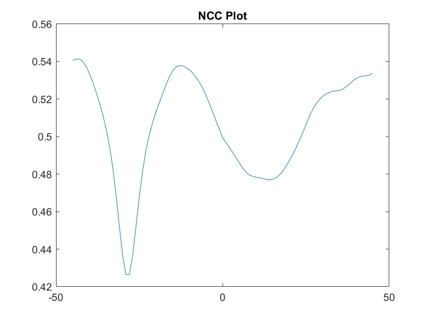
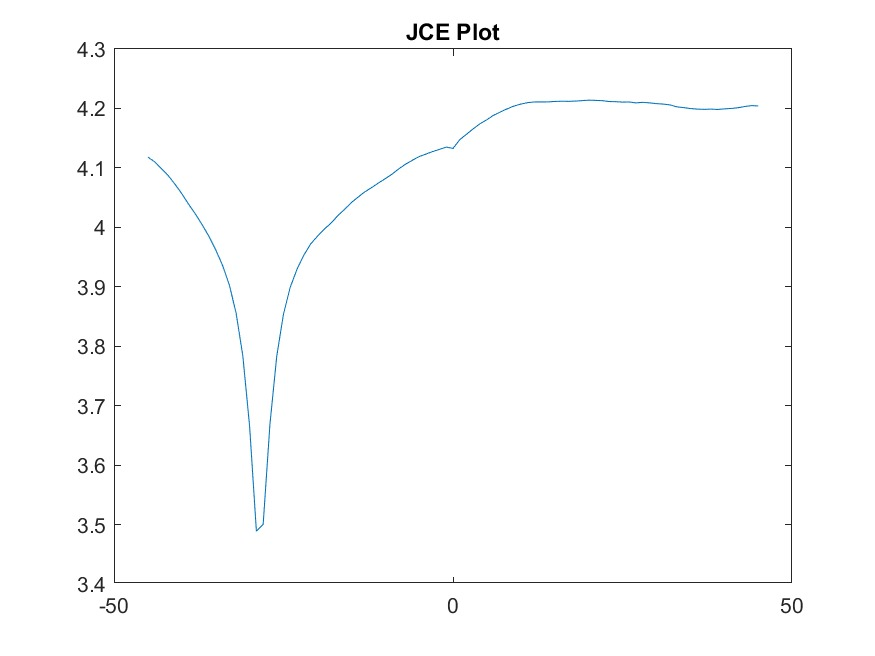
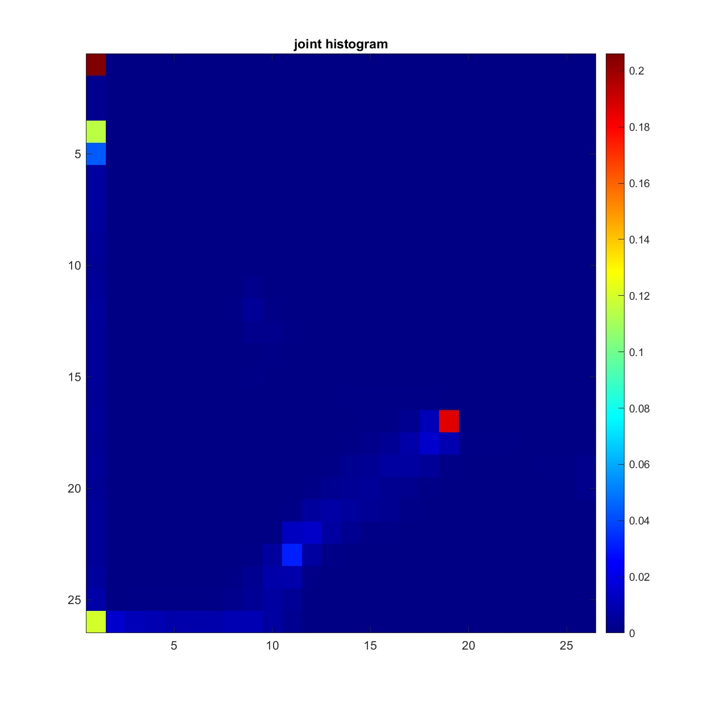
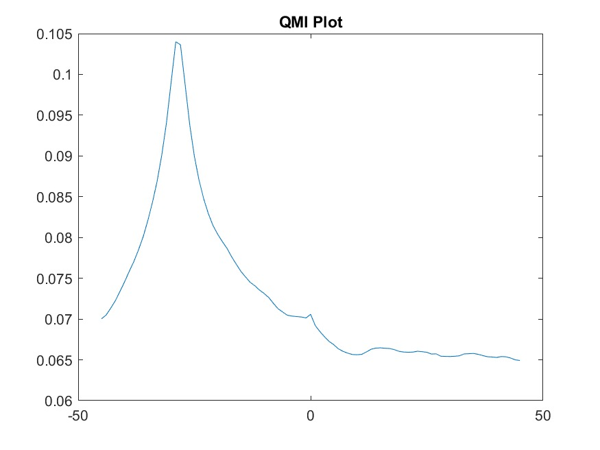
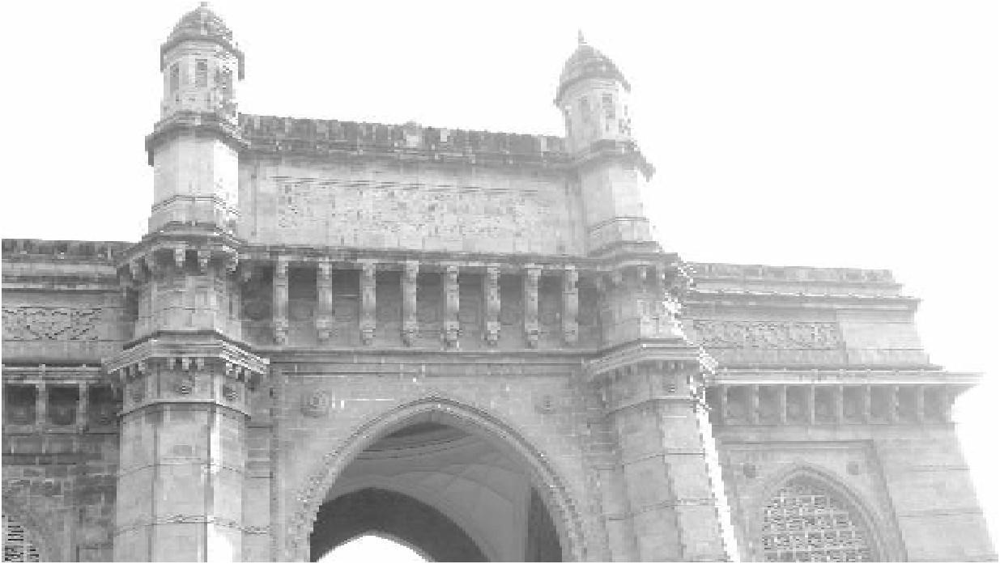
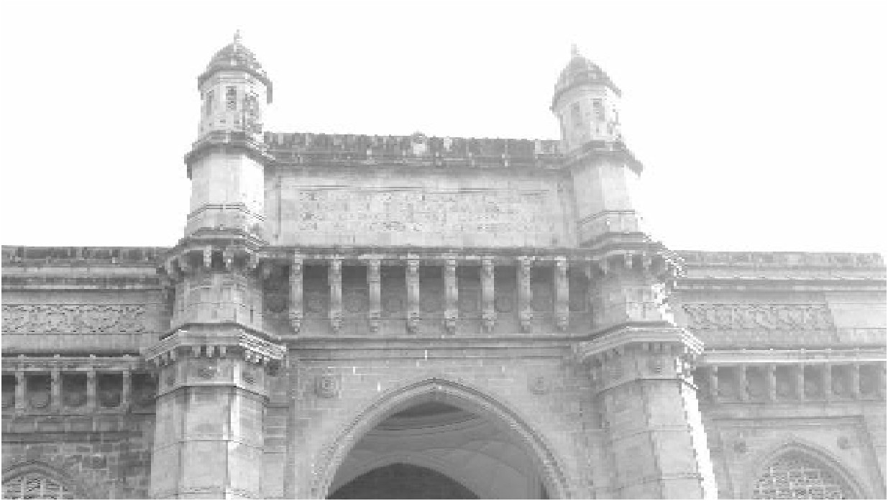
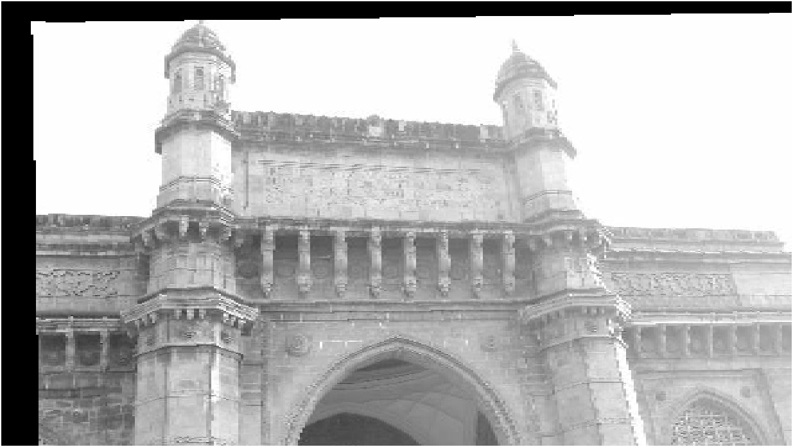

## Problem 1

### Case (a)

Ans.: **Rigid (translation + rotation)**

As the document has only been displaced in the plane of the scanner it's motion is 2D affine. The document is also rigid (it can't stretch or bend) thus no scalling or skewing is required. This means only rotation and translation are enough.

### Case (b)

Ans.: **Rigid and equal scalling in X,Y directions**

Only difference from previous case is that one scanner will have higher resolution than other. This means the image will have higher detail and thus more number of pixel in one of the scanners. This increment in pixels will be proportional in X and Y directions and can modelled by equal scalling along the axes besides rigid motion.

### Case (c)

Ans.: **Rigid and unequal scalling in X,Y directions**

In order to align the two images, one of them must be "flipped". This can be acheived by doing negative scalling along the X axis i.e. product by -1 following the rigid (along with scalling if required) motion model.

## Problem 2

Let $P(x,y)$ be a point in MATLAB image's co-ordinate space and it's corresponding point in the image's coordinate space is $Q(u,v)$. $P$ can be represented by $p = [x,y,1]^T$ in 2D Affine co-ordinates and similarly $Q$ will be $q = [u,v,1]^T$. Let $M$ be a 2D Affine transformation such that, $$q = Mp$$ 

If we assume there is no rotation and only translation and scalling along both $X$ and $Y$ directions, we get $M$ to be of the form,
$$
  M = \begin{bmatrix}
      c_x & 0 & t_x \\\
      0 & c_y & t_y \\\
      0 & 0 & 1 \\\
      \end{bmatrix}
$$

If we have 2 pairs of corresponding points $\\\{p_1, q_1\\\}$ and $\\\{p_2, q_2\\\}$ we can get the following equations,
$$
  q_1 = M\cdot p_1 \\ \\ \\ ;\\ \\ \\ 
  q_2 = M\cdot p_2
$$
$$
  \implies \begin{bmatrix}
    u_1 \\\
    v_1 \\\
    1
  \end{bmatrix} = \begin{bmatrix}
      c_x & 0 & t_x \\\
      0 & c_y & t_y \\\
      0 & 0 & 1 \\\
      \end{bmatrix}\cdot\begin{bmatrix}
    x_1 \\\
    y_1 \\\
    1
  \end{bmatrix}
$$
$$
\And  \begin{bmatrix}
    u_2 \\\
    v_2 \\\
    1
  \end{bmatrix} = \begin{bmatrix}
      c_x & 0 & t_x \\\
      0 & c_y & t_y \\\
      0 & 0 & 1 \\\
      \end{bmatrix}\cdot\begin{bmatrix}
    x_2 \\\
    y_2 \\\
    1
  \end{bmatrix}
$$
On equating corresponding elements, 
$$
  u_1 = c_x\cdot x_1 + t_x ;\\ \\ \\ 
  v_1 = c_y\cdot y_1 + t_y \\\
  u_2 = c_x\cdot x_2 + t_x ;\\ \\ \\ 
  v_2 = c_y\cdot y_2 + t_y
$$
On solving for the parameters in $M$,
$$
  c_x = \frac{u_2 - u_1}{x_2 - x_1}\\ \\ \\ ;\\ \\ \\ 
  t_x = \frac{u_1\cdot x_2 - u_2\cdot x_1}{x_2-x_1}\\\
  c_y = \frac{v_2 - v_1}{y_2 - y_1}\\ \\ \\ ;\\ \\ \\ 
  t_y = \frac{v_1\cdot y_2 - v_2\cdot y_1}{y_2-y_1}
$$
For this to hold the points $p_1$ and $p_2$ must have distinct $X$ and $Y$ co-ordinates.

## Problem 3

PDF of image $I = p_I(i)$.

PDF of image $J = p_J(j)$.

CDF of image $S = I + J$ is,
$$
  P(s) = \int_{-\infty}^{\infty}\int_{-\infty}^{s-j}p_{I,J}(i,j)\cdot di\cdot dj
$$

As $p_I$ and $p_J$ are drawn independently,
$$
  P_S(s) = \int_{-\infty}^{\infty}\int_{-\infty}^{s-j}p_I(i)\cdot p_J(j)\cdot di\cdot dj \\\
  = \int_{-\infty}^{\infty}p_J(j)\left(\int_{-\infty}^{s-j}p_I(i)\cdot di\right)dj \\\
  = \int_{-\infty}^{\infty}p_J(j)\cdot P_I(s-j)\cdot dj
$$
On taking derivative on both side w.r.t. $s$,
$$
  \frac{d}{ds}(P_S(s)) = \frac{d}{ds}\left(\int_{-\infty}^{\infty}p_J(j)\cdot P_I(s-j)\cdot dj\right)
$$
Using the Newton-Laplace formula,
$$
  p_S(s) = \int_{-\infty}^{\infty}p_J(j)\cdot\frac{d}{ds}\left(P_I(s-j)\right)\cdot dj \\\
  = \int_{-\infty}^{\infty}p_J(j)\cdot p_I(s-j)\cdot dj \\\
  = (p_I \ast p_J)(s)
$$
Therefore the PDF of the resulting image resembles the ***convolution operator*** on the input images.

## Problem 4

### Normalized Cross Correlation
Maxima: $\theta = -43\degree$ ($43\degree$ clockwise rotation)

NCC fails as a metric to find the correct rotation angle. We can also see that NCC is closer to zero at $\theta=-29\degree$. This means that the image intensities are not well correlated even when perfectly alligned. This can be due to a non-linear transformation of intensities between the two images.

### Joint Cross Entropy
Minima: $\theta = -29\degree$ ($29\degree$ clockwise rotation)

JCE is minimized at the correct $\theta=-29\degree$ angle. This works as a metric over NCC because it depends on the joint probability distribution of corresponding intensity values from the two images whereas the NCC depends directly on the intensities. 

#### Joint Histogram

### Quadratic Mutual Information
Maxima: $\theta = -29\degree$ ($29\degree$ clockwise rotation)

QMI is maximized at the correct $\theta=-29\degree$ angle. Reason for working over NCC is same as for JCE.

#### Intution for QMI

When the images have independent distributions, their QMI will come out to be $0$,
$$
  \because\\ \forall i_1,i_2,\\ \\ p_{I_1,I_2}(i_1,i_2)-p_{I_1}(i_1)\cdot p_{I_2}(i_2) = 0
$$

Extrapolating from this, when the QMI for two images is more positive it means these images are more dependent. Thus the parameter which maximizes QMI, will be the parameter which gives images with most dependent probability distributions i.e. the most similar pair of images. 

If we look at the covariance of the two images,
$$
  \text{Cov}(I_1, I_2) = E[I_1, I_2] - E[I_1]\cdot E[I_2]\\\
  = \sum_{i_1}\sum_{i_2}E[i_1,i_2] - E[i_1]\cdot E[i_2]\\\
  = \sum_{i_1}\sum_{i_2}i_1i_2(p_{I_1,I_2}(i_1,i_2) - p_{I_1}(i_1)\cdot p_{I_2}(i_2))
$$
On squaring both sides,
$$
  \text{Cov}^2(I_1,I_2) = \left(\sum_{i_1}\sum_{i_2}i_1i_2(p_{I_1,I_2}(i_1,i_2) - p_{I_1}(i_1)\cdot p_{I_2}(i_2))\right)^2\\\
$$
By applying Cauchy-Schwarz inequality,
$$
  \text{Cov}^2(I_1,I_2) \le \left(\sum_{i_1}\sum_{i_2}i_1^2i_2^2\right)\cdot \left(\sum_{i_1}\sum_{i_2}(p_{I_1,I_2}(i_1,i_2) - p_{I_1}(i_1)\cdot p_{I_2}(i_2))^2\right)\\\
  = \lVert I_1\rVert_F\cdot \lVert I_2\rVert_F\cdot \text{QMI}(I_1, I_2)
$$
On writing in terms of Correlation,
$$
  \text{Corr}^2(I_1,I_2) \le \frac{\lVert I_1\rVert_F\cdot \lVert I_2\rVert_F}{\sigma_{I_1}^2\cdot \sigma_{I_2}^2}\cdot \text{QMI}(I_1, I_2)
$$
Therefore QMI forms an upper-bound on the correlation. For smaller QMI values correlation will also be smaller.

## Problem 5

### Nearest Neighbour Interpolation
| Input Image | Target Image | Output Image |
| ------ | ------ | ------ |
|  |  |  |

### Bilinear Interpolation
| Input Image | Target Image | Output Image |
| ------ | ------ | ------ |
|  |  |  |

### Collinear Points?
Let $p_i = [x_i, y_i, 1]^T$ be the 2D affine representation for a point from the input image for $i=1,...,n$. Similarly, let $q_i = [u_i, v_i, 1]^T$ be the 2D affine representation for a point from the target image for $i=1,...,n.$

We can define $P_{3\times n}=[p_1, p_2, \dots, p_n]$ and $Q_{3\times n}=[q_1, q_2, \dots,  q_n]$. Let $M_{3\times 3}$ be the 2D affine transformation such that,
$$
  Q = M\cdot P\\\
  \implies M = (Q\cdot P^T)(P\cdot P^T)^{-1}
$$

For $M$ to be well-defined, the matrix $(P\cdot P^T)$ must be invertible.
$$
  P = \begin{bmatrix}
    x_1 & x_2 & \cdots & x_n\\\
    y_1 & y_2 & \cdots & y_n\\\
    1 & 1 & \cdots & 1\\\
  \end{bmatrix} = \begin{bmatrix}
    R_1\\\
    R_2\\\
    R_3\\\
  \end{bmatrix}
$$

If all the points from the input image lie on a line $ax+by+c=0$ then $\forall i=1,\cdots,n$, $ax_i+by_i+c=0$.
$$
  \therefore aR_1 + bR_1 + cR_3 = 0_{1\times n}
$$
As the rows of $P$ are linear combination of each other, it is rank-deficient. This implies $P^T$ is also rank-deficient.
$$
  \text{rank}(P)\le 2\\ \\ \And\\ \\ \text{rank}(P^T)\le 2\\\
  \implies \text{rank}(P\cdot P^T)\le 2
$$
Therefore the matrix $P\cdot P^T$ is not invertible. Hence when all the points in $P$ are collinear, $M$ cannot be well-defined.