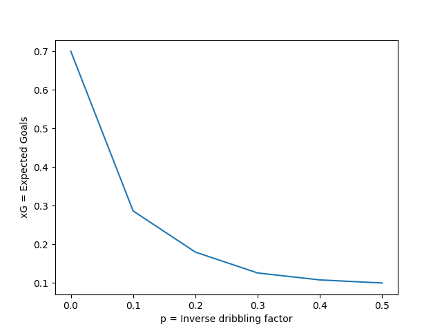
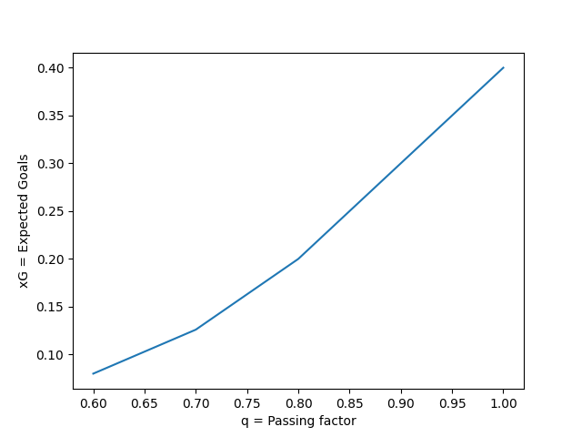

## Task 1

Within the `planner.py` file, all the three algorithms of value iteration, linear programming and Howard's policy improvement are implemented under the function `optimal_policy()`. The code is not parallelized much due to memory constraints and simply loops through all the transitions in the worst case. Assuming the number of states in below 10,000, the number of actions is below 100 and the number of transitions is below 3,50,000, this code should execute within a few seconds.

The three algorithms are implemented as described in the course slides. Linear programming algorithm makes use of the `pulp` library. For this algorithm the library function for solving the linear program was found to be the bottle-neck and hence it was the slowest one out of the three algorithms. It was also observed that both of the iteration based algorithms, value iteration and Howard's policy improvement, converge to the optimal policy very fast i.e. under 5-10 iterations. The default algorithm is value iteration as it was observed to be the fastest one out of the three.

There is another function called `value_function()` which returns the values for all the states in the given mdp instance for a given policy. This function basically solves the Bellman equations using the `pulp` library. It is called whenever `--policy` argument is passed to this program.

## Task 2

Let the mdp corresponding to the football problem be $\langle S, A, T, R, \gamma\rangle$. We define each component as,
- **Set of states**: Here the first 2 states, $\text{GOAL}$ and $\text{NO-GOAL}$ are terminal states. Rest are for a particular game state.
  $$
    S = \\\{\text{GOAL}, \text{NO-GOAL}\\\}\cup\\\{[b_1,b_2,r,s]\\ |\\ b_1,b_2,r\in\\\{01, 02, \dots, 16\\\}, s\in\\\{1,2\\\}\\\}\\\
    \\ \\\
    \therefore |S| = 2 + 16^3\cdot 2 = 8194
  $$
- **Set of actions**: As defined in the problem statement, at each game state the agent can control the two players $b_1$ and $b_2$. These 2 players can perform 10 actions. $0,1,2,3$ correspond to $b_1$'s movement, $4,5,6,7$ correspond to $b_2$'s movement, $8$ for passing and $9$ for shooting.
  $$
    \therefore A = \\\{0, 1, \dots, 9\\\}
  $$
- **Transition Function**: $T:S\times A\times S\to[0,1]$ is the transition function. This is defined as given in the problem statement with parameters $p$ and $q$. Any action that leads to the episode's unsuccessful end has a transition into the $\text{NO-GOAL}$ state. Similarly a successful shot has a transition into the $\text{GOAL}$ state.
- **Reward Function**: $R:S\times A\times S\to\R$ is the reward function which is defined to be 1 for a transition $s_1\xrightarrow{a}s_2$ when $s_2=\text{GOAL}$ and otherwise 0.
- **Discount Factor**: Since this is an episodic task it's $\gamma=1$. This is a fair assumption since we only want to find the expected goals from any game state i.e. the probability of reaching to the $\text{GOAL}$ state. This state is terminal by definition and the reward function is also defined with this in mind.

### Plots and Observations

The expected goals from the starting state [05, 09, 08, 1] for the 3 test-cases is,
1. **Greedy Defense** ($p=0.25$, $q=0.75$): 0.175000 with optimal action being 1 i.e. moving $b_1$ towards right.
2. **Parking the Bus** ($p=0.15$, $q=0.95$): 0.203203 with opimal action being 5 i.e. moving $b_2$ towards right.
3. **Random Policy** ($p=0.35$, $q=0.65$): 0.080244 with opitmal action being 5 i.e. moving $b_2$ towards right.

> The first plot is between different values of $p$ and the $xG$ for [05, 09, 08, 1] game state with $q=0.7$. For lower values of $p$ the players $b_1$ and $b_2$ are better at dribbling, avoiding tackles and overall movement. Hence I call $p$ the **inverse dribbling factor**. This effect can also be seen in the plot below.
> 
> 

> The second plot is between different values of $q$ and the $xG$ for [05, 09, 08, 1] game state with $p=0.3$. For higher values of $q$ the players $b_1$ and $b_2$ are better at passing and shooting. Hence I call $q$ the **passing factor**. This effect can also be seen in the plot below.
> 
> 