## Problem 1

### Gaussian Noise with 5 Stdev

#### Barbara ($\sigma = 5$)

> | Original | Noisy |
> |---|---|
> |||
> 
> |$(\sigma_s,\sigma_r)=(0.1,0.1)$|$(\sigma_s,\sigma_r)=(2,2)$|$(\sigma_s,\sigma_r)=(3,15)$|
> |---|---|---|
> ||||

#### Kodak ($\sigma = 5$)

> | Original | Noisy |
> |---|---|
> |||
> 
> |$(\sigma_s,\sigma_r)=(0.1,0.1)$|
> |---|
> ||
> 
> |$(\sigma_s,\sigma_r)=(2,2)$|
> |---|
> |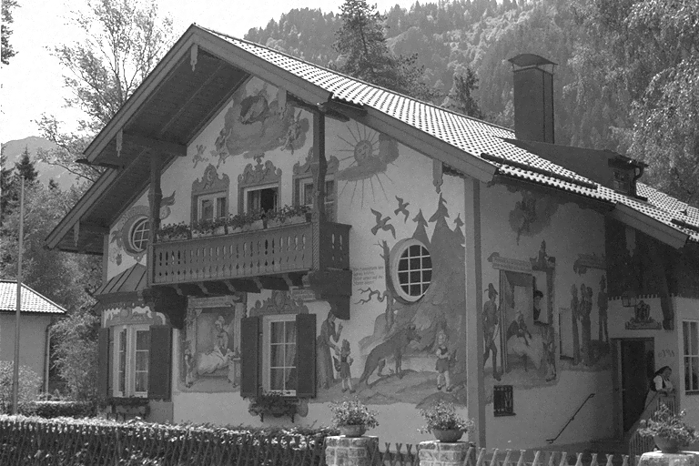|
> 
> |$(\sigma_s,\sigma_r)=(3,15)$|
> |---|
> ||

### Gaussian Noise with 10 Stdev

#### Barbara ($\sigma = 10$)

> | Original | Noisy |
> |---|---|
> |||
> 
> |$(\sigma_s,\sigma_r)=(0.1,0.1)$|$(\sigma_s,\sigma_r)=(2,2)$|$(\sigma_s,\sigma_r)=(3,15)$|
> |---|---|---|
> ||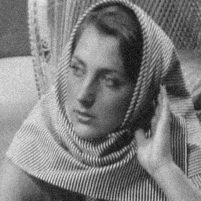||

#### Kodak ($\sigma = 10$)

> | Original | Noisy |
> |---|---|
> |||
> 
> |$(\sigma_s,\sigma_r)=(0.1,0.1)$|
> |---|
> ||
> 
> |$(\sigma_s,\sigma_r)=(2,2)$|
> |---|
> ||
> 
> |$(\sigma_s,\sigma_r)=(3,15)$|
> |---|
> ||

For $\sigma=5$ noisy images,

- For both Barbara and Kodak images $(0.1,0.1)$ mean shift algorithm doesn’t cause much difference.
- Although it’s subjective, best results seem to be for the $(2,2)$ mean shift algorithm for denoising. This can be seen for the resulting Kodak image as it resembles the original Kodak image closely.
- For both images, $(3,15)$ mean shift algorithm leads to too much smoothing and loss of details compared to the original image. But it segment the image into distinct parts.

For $\sigma=10$ noisy images,

- Both the $(0.1,0.1)$ and $(2,2)$ filters seem to be too weak.
- The $(3,15)$ filter produces the best results but just as in the $\sigma=5$ case, the smoothing is too strong.

## Problem 2

> All Fourier transform images are shifted (center is the origin) and in Log absolute form. For example,
> 
> |Input Image|
> |---|
> ||
> 
> |Input's Fourier Transform|
> |---|
> |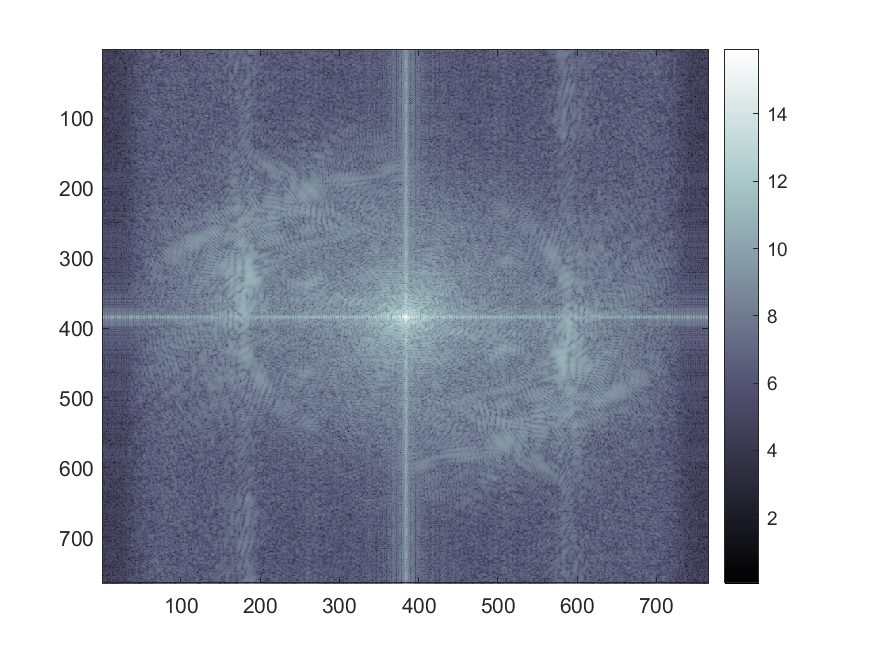|

### Ideal Low-pass Filters

#### $D=40$

> |Ideal Low-pass Filter with $D=40$|
> |---|
> |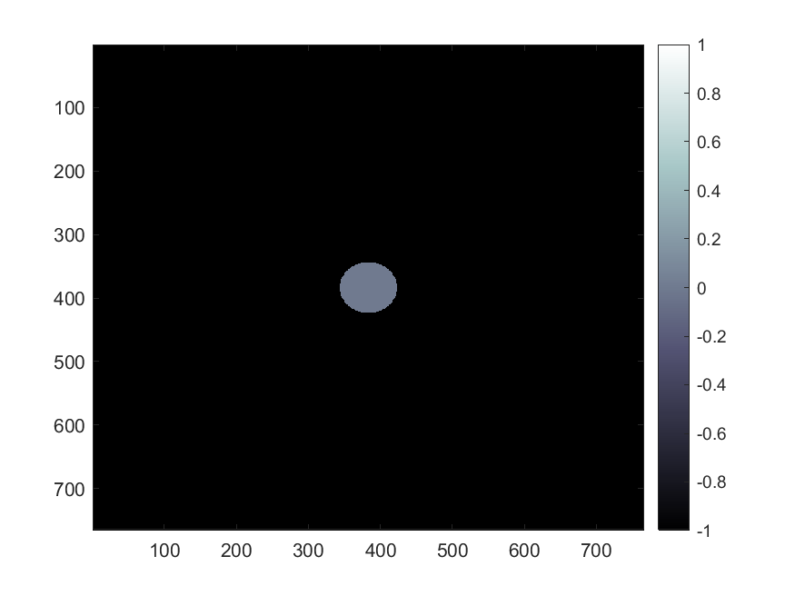|
> 
> |Output's Fourier Transform|
> |---|
> ||
> 
> Output Image|
> |---|
> |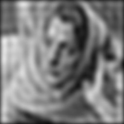|

#### $D=80$

> |Ideal Low-pass Filter with $D=80$|
> |---|
> |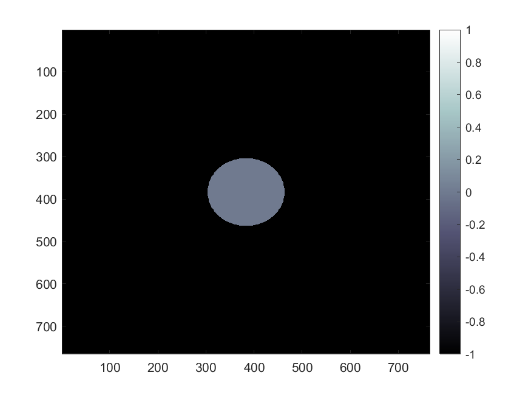|
> 
> |Output's Fourier Transform|
> |---|
> ||
> 
> |Output Image|
> |---|
> ||

#### Observations

1. The filter size is naturally larger for $D=80$ than $D=40$. This means there is a loss of many higher frequencies in the $D=40$ case.
2. In both the output images, there seems to loss of detail compared to the original image. This validates the image compression effects discussed in class.
3. Wave-like pattern can be seen in both the outputs. These are much denser in the output for $D=80$.
4. It can also be seen that the output for $D=80$ looks closer to the original image than the output for $D=40$. This can be explained by the loss of high frequencies for $D=40$ which lead to fine details in the resulting image.

### Gaussian Low-pass Filters

#### $\sigma=40$

> |Gaussian Low-pass Filter with $\sigma=40$|
> |---|
> |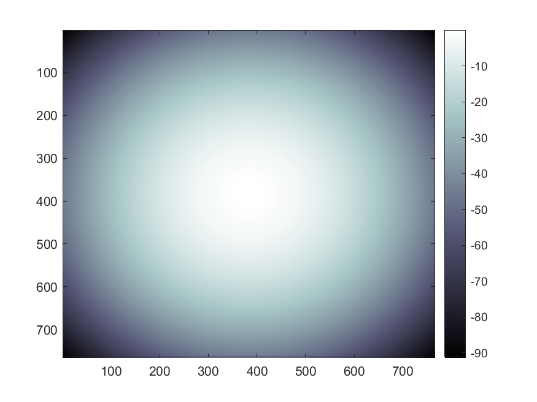|
> 
> |Output's Fourier Transform|
> |---|
> |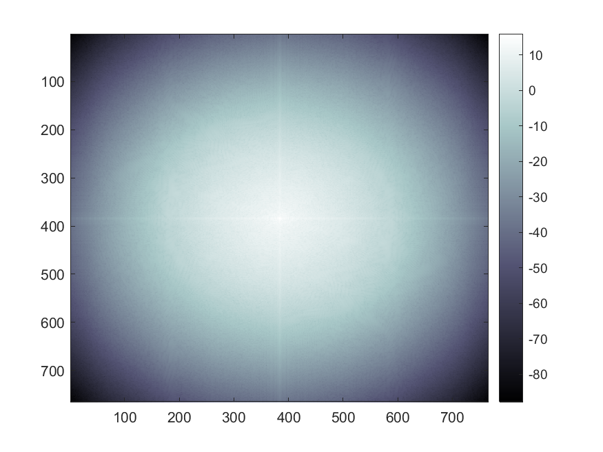|
> 
> Output Image|
> |---|
> ||

#### $\sigma=80$

> |Gaussian Low-pass Filter with $\sigma=80$|
> |---|
> ||
> 
> |Output's Fourier Transform|
> |---|
> |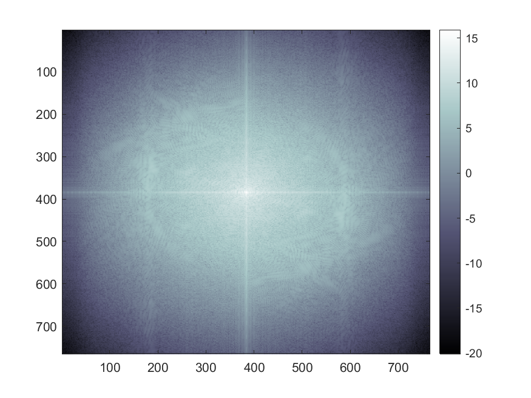|
> 
> Output Image|
> |---|
> ||

#### Observations

1. It might look like the filter images are identical for both $\sigma$'s because of the colormap scalling after taking log-absolute, but the actual scale is drastically different in the images.
2. If we compare the outputs' Fourier transforms to the original image's Fourier transform, it can be seen that the $\sigma=80$ filter preserves more qualities from the original Fourier transform, than the $\sigma=40$ filter.
3. The final outputs look as if the original image has been subjected to Gaussian blurring. This also follows from the fact that Fourier inverse of a Gaussian function is another Gaussian function.
4. On comparing the two outputs, it can be seen that $\sigma=80$ has caused less smoothing than $\sigma=40$. This also follows from the fact that upon taking Fourier inverse, the standard deviation of the new Gaussian is inversely proportional to the standard deviation of the initial Gaussian.

## Problem 3

Here we assume all discrete 2D signals are of the form $\Z_M\times\Z_N\to\R$ such that their indices (inputs) add modulo $M$ along $x$ component and modulo $N$ along $y$ component. Then we can write the discrete 2D Fourier transform as,
$$
  \hat f_{u,v} = \frac{1}{\sqrt{MN}}\sum_{x=0}^{M-1}\sum_{y=0}^{N-1}f_{x,y}\exp\left(-2\pi i\left(\frac{ux}{M}+\frac{vy}{N}\right)\right)
$$
Here, the normalization of the Fourier transform is as per the course slides. We can write discrete 2D convolution $h=f\ast g$ as,
$$
  h_{x,y} = \sum_{m=0}^{M-1}\sum_{n=0}^{N-1}f(m,n)g(x-m,y-n)
$$

Hence we can write,
$$
  \hat h_{u,v} = \frac{1}{\sqrt{MN}}\sum_{x=0}^{M-1}\sum_{y=0}^{N-1}h_{x,y}\exp\left(-2\pi i\left(\frac{ux}{M}+\frac{vy}{N}\right)\right)\\\
  \\ \\\
  = \frac{1}{\sqrt{MN}}\sum_{x=0}^{M-1}\sum_{y=0}^{N-1}\\ \left[\sum_{m=0}^{M-1}\sum_{n=0}^{N-1}f(m,n)g(x-m,y-n)\right]\\ \exp\left(-2\pi i\left(\frac{ux}{M}+\frac{vy}{N}\right)\right)\\\
  \\ \\\
  = \sum_{m=0}^{M-1}\sum_{n=0}^{N-1}\frac{f(m,n)}{\sqrt{MN}}\exp\left(-2\pi i\left(\frac{um}{M}+\frac{vn}{N}\right)\right)\left[\sum_{x=0}^{M-1}\sum_{y=0}^{N-1}\\ g(x-m,y-n)\exp\left(-2\pi i\left(\frac{u(x-m)}{M}+\frac{v(y-n)}{N}\right)\right)\right]\\\
  \\ \\\
  = \frac{1}{\sqrt{MN}}\sum_{m=0}^{M-1}\sum_{n=0}^{N-1}f(m,n)\exp\left(-2\pi i\left(\frac{um}{M}+\frac{vn}{N}\right)\right)\left[\sum_{x=-m}^{M-1-m}\sum_{y=-n}^{N-1-n}\\ g(x,y)\exp\left(-2\pi i\left(\frac{ux}{M}+\frac{vy}{N}\right)\right)\right]\\\
  \\ \\\
$$
In the inner square bracket, the indices over which $x$ and $y$ interate are to be taken modulo $M$ and $N$ respectively. This means for every value of $(m,n)$, the indices $(x,y)$ are guranteed to iterate over all values in $\Z_M\times\Z_N$. This inner bracket can hence be rewritten and taken out as a common factor, as it is independent of $m$ and $n$.
$$
  \hat h_{u,v} = \frac{1}{\sqrt{MN}}\left[\sum_{m=0}^{M-1}\sum_{n=0}^{N-1}f(m,n)\exp\left(-2\pi i\left(\frac{um}{M}+\frac{vn}{N}\right)\right)\right]\cdot\left[\sum_{x=0}^{M-1}\sum_{y=0}^{N-1}\\ g(x,y)\exp\left(-2\pi i\left(\frac{ux}{M}+\frac{vy}{N}\right)\right)\right]\\\
  \\ \\\
  \therefore\hat h_{u,v}= \sqrt{MN}\cdot \hat f_{u,v}\\ \hat g_{u,v}\\\
  \\ \\\
$$
This proves the convolution theorem. The $\sqrt{MN}$ factor is an artifact of the normalization assumed earlier.

## Problem 4

We are given a discrete 2D image $f:\Z_{201}\times\Z_{201}\to\R$ such that,
$$
  f_{x,y} = \left\\{ \begin{array}{lr}
    255 & y=100\\\
    0 & \text{otherwise}\\\
  \end{array}\right\\}\\\
  \\ \\\
$$
We assume normalization using only a factor of $1$ and not the usual $\frac{1}{\sqrt{MN}}$ since this is what Matlab implements. The discrete 2D Fourier transform of this image $\hat f:\Z_{201}\times\Z_{201}\to\mathbb{C}$ is,
$$
  \hat f_{u,v} = \sum_{x=0}^{200}\sum_{y=0}^{200}f_{x,y}\cdot e^{-2\pi i(ux+vy)/201}\\\
  \\ \\\
  = \sum_{x=0}^{200}255\cdot e^{-2\pi i(ux+v100)/201}\\\
  \\ \\\
  = 255e^{-2\pi iv100/201}\sum_{x=0}^{200}e^{-2\pi iux/201}\\\
  \\ \\\
  = 255e^{-2\pi iv100/201}\sum_{x=0}^{200}(e^{-2\pi ix/201})^u\\\
  \\ \\\
$$
The summation is simply the sum of $u^{\text{th}}$ powers of $201^{\text{st}}$ roots of unity. This evaluates to,
$$
  \hat f_{u,v} = \left\\{ \begin{array}{lr}
    51255\cdot e^{-2\pi iv100/201} & u=0\\\
    0 & \text{otherwise}\\\
  \end{array}\right\\}\\\
  \\ \\\
  \implies |\hat f_{u,v}| = \left\\{ \begin{array}{lr}
    51255 & u=0\\\
    0 & \text{otherwise}\\\
  \end{array}\right\\}\\\
  \\ \\\
$$
|Original Image|Log abs of Fourier Transform|
|---|---|
|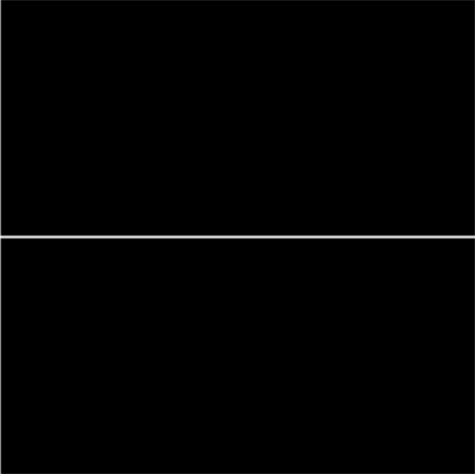|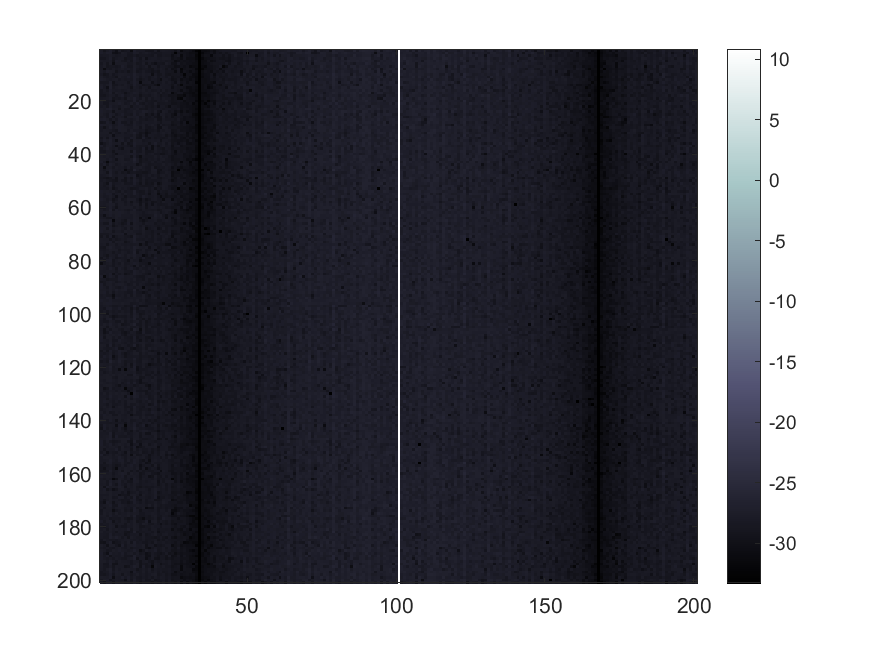|

## Problem 5

### Real $f$

When $f:\Z_M\times\Z_N\to\R$,
$$
  F(u,v) = \frac{1}{\sqrt{MN}}\sum_{x=0}^{M-1}\sum_{y=0}^{N-1}f(x,y)\exp\left(-2\pi i\left(\frac{ux}{M}+\frac{vy}{N}\right)\right)\\\
  \\ \\\
  \therefore F^\ast(u,v) = \frac{1}{\sqrt{MN}}\sum_{x=0}^{M-1}\sum_{y=0}^{N-1}\left(f(x,y)\exp\left(-2\pi i\left(\frac{ux}{M}+\frac{vy}{N}\right)\right)\right)^\ast\\\
  \\ \\\
  = \frac{1}{\sqrt{MN}}\sum_{x=0}^{M-1}\sum_{y=0}^{N-1}f(x,y)\left(\exp\left(-2\pi i\left(\frac{ux}{M}+\frac{vy}{N}\right)\right)\right)^\ast\\\
  \\ \\\
  = \frac{1}{\sqrt{MN}}\sum_{x=0}^{M-1}\sum_{y=0}^{N-1}f(x,y)\exp\left(2\pi i\left(\frac{ux}{M}+\frac{vy}{N}\right)\right)\\\
  \\ \\\
  = F(-u,-v)\\\
$$

### Real and even $f$

When $f:\Z_M\times\Z_N\to\R$ such that $f(x,y)=f(-x,-y)$,
$$
  F(u,v) = \frac{1}{\sqrt{MN}}\sum_{x=0}^{M-1}\sum_{y=0}^{N-1}f(x,y)\exp\left(-2\pi i\left(\frac{ux}{M}+\frac{vy}{N}\right)\right)\\\
  \\ \\\
  \therefore F(-u,-v) = \frac{1}{\sqrt{MN}}\sum_{x=0}^{M-1}\sum_{y=0}^{N-1}f(x,y)\exp\left(-2\pi i\left(\frac{-ux}{M}+\frac{-vy}{N}\right)\right)\\\
  \\ \\\
  = \frac{1}{\sqrt{MN}}\sum_{x=0}^{M-1}\sum_{y=0}^{N-1}f(-x,-y)\exp\left(-2\pi i\left(\frac{u(-x)}{M}+\frac{v(-y)}{N}\right)\right)\\\
  \\ \\\
  = \frac{1}{\sqrt{MN}}\sum_{x=1-M}^{0}\sum_{y=1-N}^{0}f(x,y)\exp\left(-2\pi i\left(\frac{ux}{M}+\frac{vy}{N}\right)\right)\\\
  \\ \\\
$$
Here $x$ iterates over the values in $\\\{1-M,2-M,\dots,-1,0\\\}$. As these index values are modulo $M$, the set can be rewritten as $\\\{1,2,\dots,M-1,0\\\}$ by adding $M$ to all but the last element. By doing the same for $y$ we can write,
$$
  F(-u,-v) = \frac{1}{\sqrt{MN}}\sum_{x=0}^{M-1}\sum_{y=0}^{N-1}f(x,y)\exp\left(-2\pi i\left(\frac{ux}{M}+\frac{vy}{N}\right)\right)\\\
  \\ \\\
  \therefore F(-u,-v)=F(u,v)
$$
From the previous result,
$$
  F^\ast(u,v)=F(-u,-v)=F(u,v)
$$
Hence $F$ is also real and even.

## Problem 6

For a continuous signal $f:\R\to\mathbb{C}$,
$$
  \mathcal{F}(f)(\mu) = \int_{-\infty}^{\infty}f(t)e^{-2\pi i\mu t}dt
$$
Since $\mathcal{F}(f):\R\to\mathbb{C}$,
$$
  \mathcal{F}(\mathcal{F}(f))(\mu) = \int_{-\infty}^{\infty}\mathcal{F}(f)(t)e^{-2\pi i\mu t}dt\\\
  \\ \\\
  = \int_{-\infty}^{\infty}\left[\int_{-\infty}^{\infty}f(s)e^{-2\pi its}ds\right]e^{-2\pi i\mu t}dt\\\
  \\ \\\
  = \int_{-\infty}^{\infty}\int_{-\infty}^{\infty}f(s)e^{-2\pi its} e^{-2\pi i\mu t}ds\\ dt\\\
  \\ \\\
  = \int_{-\infty}^{\infty}f(s)\left[\int_{-\infty}^{\infty}e^{-2\pi it(s+\mu)}dt\right]ds\\\
  \\ \\\
  = \int_{-\infty}^{\infty}f(s)\cdot\delta(s+\mu)ds\\\
  \\ \\\
  = f(-\mu)
$$
Using the sifting property of the Dirac delta distribution we obtained the above result.
$$
  \mathcal{F}(\mathcal{F}(\mathcal{F}(\mathcal{F}(f))))(\mu) = \mathcal{F}(\mathcal{F}(f))(-\mu)\\\
  \\ \\\
  = f(\mu)\\\
  \\ \\\
  \therefore \mathcal{F}(\mathcal{F}(\mathcal{F}(\mathcal{F}(f)))) = f
$$

## Problem 7

All of the given high-pass filters $H_{\text{high}}$, can be written in terms of their corresponding low-pass variants $H_{\text{low}}$, as,
$$
  H_{\text{high}}(u,v) = 1 - H_{\text{low}}(u,v)
$$

The Fourier inverse of such a high-pass filter will be,
$$
\begin{align*}
  h_{\text{high}}(x,y) & = \int_{-\infty}^{\infty}\int_{-\infty}^{\infty}(1-H_{\text{low}}(u,v))e^{2\pi i(ux+vy)}du\cdot dv\\\
  & = \int_{-\infty}^{\infty}\int_{-\infty}^{\infty}e^{2\pi i(ux+vy)}du\cdot dv - \int_{-\infty}^{\infty}\int_{-\infty}^{\infty}H_{\text{low}}(u,v)e^{2\pi i(ux+vy)}du\cdot dv\\\
  & = \delta(x,y) - h_{\text{low}}(x,y)
\end{align*}
$$

If we are able to show that the Fourier inverses of the low-pass filters are bounded, then because of the delta function there will be a spike present at the origin. For any low-pass filter,
$$
\begin{align*}
  |h_{\text{low}}(x,y)| & = \left|\int_{-\infty}^{\infty}\int_{-\infty}^{\infty}H_{\text{low}}(u,v)e^{2\pi i(ux+vy)}du\cdot dv\right|\\\
  & \le \int_{-\infty}^{\infty}\int_{-\infty}^{\infty}|H_{\text{low}}(u,v)e^{2\pi i(ux+vy)}|du\cdot dv\\\
  & = \int_{-\infty}^{\infty}\int_{-\infty}^{\infty}|H_{\text{low}}(u,v)|du\cdot dv
\end{align*}
$$

We can bound the Fourier inverse using this integral as it is a constant for a particular filter. Now we compute or bound this constant for the given filters.

### Ideal High-pass Filter

Ideal High-pass filter is,
$$
\begin{align*}
  H_{\text{high}}(u,v) & = 1-H_{\text{low}}(u,v)\\\
  & = 1 - \left\\{ \begin{array}{lr}
    1 & u^2+v^2\le D^2\\\
    0 & \text{otherwise}\\\
  \end{array}\right\\}
\end{align*}
$$

For bounding the Fourier inverse of Ideal Low-pass filter,
$$
\begin{align*}
  |h_{\text{low}}(x,y)| & \le \int_{-\infty}^{\infty}\int_{-\infty}^{\infty}|H_{\text{low}}(u,v)|du\cdot dv\\\
  & = \int_{0}^{D}\int_{0}^{2\pi}d\theta\cdot\rho d\rho\\\
  & = D^2\pi
\end{align*}
$$

Hence the Fourier inverse of the ideal low-pass filter is bounded by $D^2\pi$.

### Gaussian High-pass Filter

Gaussian High-pass filter is,
$$
\begin{align*}
  H_{\text{high}}(u,v) & = 1 - H_{\text{low}}(u,v)\\\
  & = 1 - e^{-(u^2+v^2)/2\sigma^2}
\end{align*}
$$

For bounding the Fourier inverse of Gaussian Low-pass filter,
$$
\begin{align*}
  |h_{\text{low}}(x,y)| & \le \int_{-\infty}^{\infty}\int_{-\infty}^{\infty}|H_{\text{low}}(u,v)|du\cdot dv\\\
  & = \int_{0}^\infty\int_{0}^{2\pi}e^{-\rho^2/2\sigma^2}d\theta\cdot\rho d\rho\\\
  & = 2\pi\sigma^2\int_0^\infty e^{-t}dt\\\
  & = 2\pi\sigma^2
\end{align*}
$$

Hence the Fourier inverse of the Gaussian low-pass filter is bounded by $2\pi\sigma^2$.

### Butterworth High-pass Filter

Butterworth High-pass filter is,
$$
\begin{align*}
  H_{\text{high}}(u,v) & = 1 - H_{\text{low}}(u,v)\\\
  & = 1 - \frac{1}{1+((u^2+v^2)/D^2)^n}
\end{align*}
$$

For bounding the Fourier inverse of Butterworth Low-pass filter,
$$
\begin{align*}
  |h_{\text{low}}(x,y)| & \le \int_{-\infty}^{\infty}\int_{-\infty}^{\infty}|H_{\text{low}}(u,v)|du\cdot dv\\\
  & = \int_{0}^{\infty}\int_{0}^{2\pi}\frac{1}{1+(\rho/D)^{2n}}d\theta\cdot\rho d\rho\\\
  & = \pi\int_{0}^{\infty}\frac{2\rho}{1+(\rho/D)^{2n}}d\rho\\\
  & = D^2\pi\int_{0}^{\infty}\frac{dt}{1+t^n}\\\
  & \le D^2\pi\left[\int_0^1dt+\int_1^\infty\frac{dt}{1+t^2}\right]\\\
  & = D^2\pi(1 + \pi/4)
\end{align*}
$$

Hence the Fourier inverse of the Butterworth low-pass filter with parameters $[n\ge2,D]$ is bounded by $D^2\pi(1+\pi/4)$.

When $n=1$,
$$
\begin{align*}
  h_{\text{high}}(0,0) & = \int_{0}^{\infty}\int_{0}^{2\pi}\left(1-\frac{\rho}{1+(\rho/D)^{2}}\right)d\theta\cdot d\rho\\\
  & = 2D^2\pi\int_0^\infty\frac{1-k+k^2}{1+k^2}dk\\\
  & \to +\infty
\end{align*}
$$
Hence we will still obeserve a spike at the origin.
