## Problem 1

### ORL Dataset recognition

Graphs of recognition rates for different values of $k$ (principal components).

|Eigen-decomposition|Singular Value Decomposition|
|---|---|
|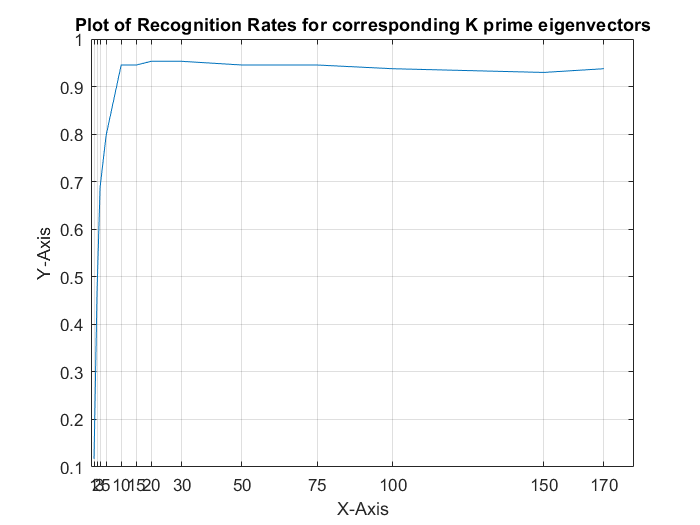|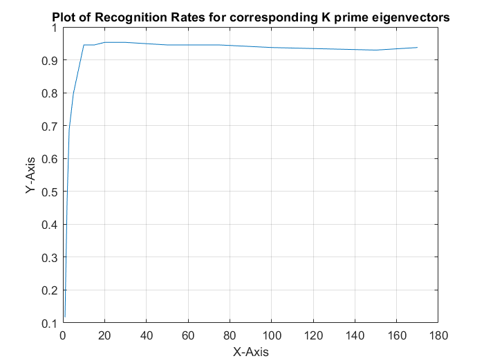|

### Yale Dataset recognition

Graphs of recognition rates for different values of $k$ (principal components).

|All eigen components|
|---|
||

|All but top 3 eigen components|
|---|
|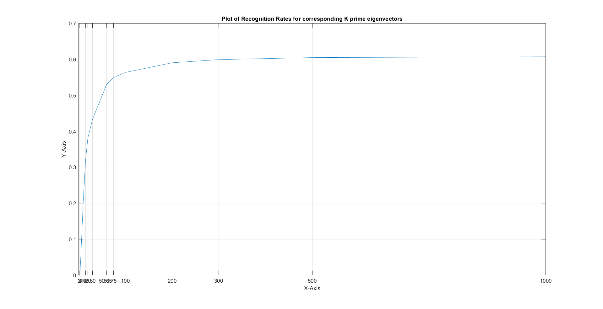|

### Face Reconstruction

Face reconstruction done on the first image of first subject in ORL dataset.

|-|-|-|
|---|---|---|
|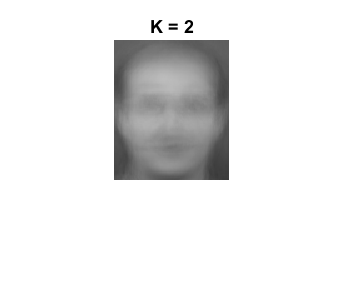|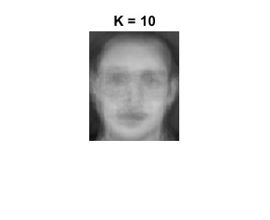|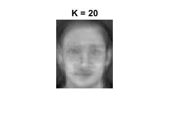|
|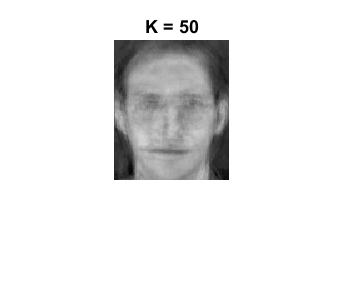|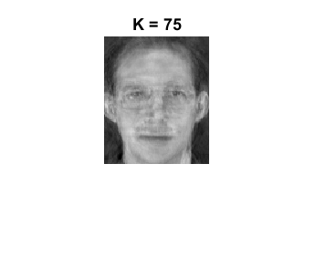||
|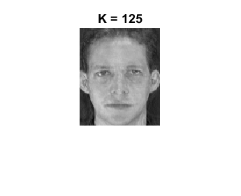|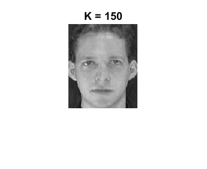||

### Eigenfaces

|Top 25 eigenfaces of ORL dataset|
|---|
|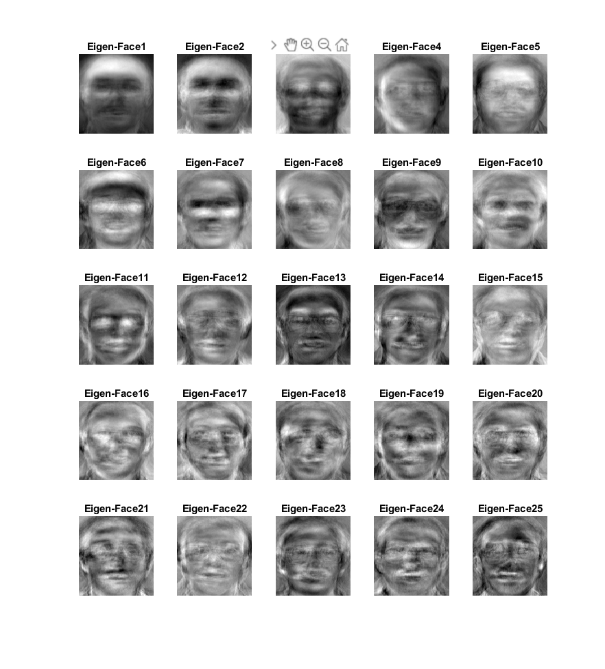|

## Problem 2

### Proposed Mechanism

> We compare the test images with all 6 images of each person (32 in total) in the training dataset. This comparison is done by taking the average of squared differences of eigen-coefficients for the test image and the 6 images of each person. If the least of all these 32 values is more than a threshold, we mark that the test person has no other photo in the training data(i.e. we mark it NEGATIVELY).

### Results

For K = 10 and cutoff = 100,
- False Positives: 16.875%
- False Negatives: 10%

## Problem 3

We have to find the unit vector $f\in\R^d$ that maximises $f^TCf$ such that $f$ is perpendicular to $e$. Thus we need to maximise the following,
$$
  \\ \\\
  f^TCf - \lambda(f^Tf-1) - \mu(f^Te-1)\\\
$$
Differentiating w.r.t. $\lambda$ gives $f^Tf=1$ and w.r.t. $\mu$ gives $f^Te=1$.

Differentiating w.r.t. $f$ gives,
$$
  2f^TC-2\lambda f^T-\mu e^T=0
$$
On post multiplying by $e$ vector,
$$
  2f^TCe-2\lambda f^Te-\mu e^Te=0\\\
  \\ \\\
  \implies 2\lambda_e f^Te-0-\mu = 0\\\
  \\ \\\
  \implies 0-\mu=0\\\
  \\ \\\
  \implies\mu=0
$$
Substituting this back in the above equation,
$$
  \\ \\\
  \therefore f^TC=\lambda f^T\\\
  \\ \\\
  \implies C^T f=\lambda f\\\
  \\ \\\
  \implies Cf=\lambda f\\\
  \\ \\\
$$
Therefore $f$ is an eigenvector. Putting this in the original objective,
$$
  f^T\lambda f = \lambda
$$
Hence to further maximise this, $f$ must be the eigenvector with the $2^\text{nd}$ largest eigenvalue.

To find unit vector $g$ that maximises $g^TCg$ subject to $g$ being perpendicular to both $f$ and $e$, we should maximise the following,
$$
  g^TCg-\lambda(g^Tg-1)-\mu_1(g^Te)-\mu_2(g^Tf)
$$
On differentiation w.r.t. $\lambda,\mu_1,\mu_2$ we get,
$$
  \\ \\\
  g^Tg=1;\\ \\ g^Te=0;\\ \\ g^Tf=0
$$
Differentiating w.r.t. $g$ given,
$$
  \\ \\\
  2g^TC-2\lambda g^T-\mu_1e^T-\mu_2f^T=0
$$
On post multiplying by $e$,
$$
  \\ \\\
  2g^TCe-2\lambda g^Te-\mu_1e^Te-\mu_2f^Te=0\\\
  \\ \\\
  \implies 2\lambda_e g^Te-0-\mu_1-0=0\\\
  \\ \\\
  \implies \mu_1=0
$$
On post multiplying by $f$,
$$
  \\ \\\
  2g^TCf-2\lambda g^Tf-\mu_1e^Tf-\mu_2f^Tf=0\\\
  \\ \\\
  \implies 2\lambda_f g^Tf-0-0-\mu_2=0\\\
  \\ \\\
  \implies \mu_2=0
$$
Putting these values back into the above equation,
$$
  2g^TC-2\lambda g^T=0\\\
  \\ \\\
  \implies g^TC=\lambda g^T\\\
  \\ \\\
  \implies C^Tg=\lambda g\\\
  \\ \\\
  \implies Cg=\lambda g
$$
Therefore $g$ is also an eigenvector with eigenvalue as the Lagrange multiplier $\lambda$. Putting this in the original objective,
$$
  g^TCg = \lambda g^Tg=\lambda
$$
To maximise this $g$ must be the eigenvector with $3^\text{rd}$ largest eigenvalue.

## Problem 4

a) Covariance matrix of a dataset $\\\{x_i\in\R^d\\\}_{i=1}^N$ is defined as,

$$
  C = \sum_{i=1}^N(x_i-\bar x)(x_i-\bar x)^T\\\
  \\ \\\
  C^T = \left(\sum_{i=1}^N(x_i-\bar x)(x_i-\bar x)^T\right)^T\\\
  \\ \\\
  = \sum_{i=1}^N\left((x_i-\bar x)(x_i-\bar x)^T\right)^T\\\
  \\ \\\
  = \sum_{i=1}^N((x_i-\bar x)^T)^T(x_i-\bar x)^T\\\
  \\ \\\
  = \sum_{i=1}^N(x_i-\bar x)(x_i-\bar x)^T\\\
  \\ \\\
  \therefore C^T=C
$$
Hence C is symmetric.

For a vector $v\in\R^d$,
$$
  v^TCv=v^T\left(\sum_{i=1}^N(x_i-\bar x)(x_i-\bar x)^T\right)v\\\
  \\ \\\
  = \sum_{i=1}^Nv^T(x_i-\bar x)(x_i-\bar x)^Tv\\\
  \\ \\\
  = \sum_{i=1}^N((x_i-\bar x)^Tv)^T(x_i-\bar x)^Tv\\\
  \\ \\\
  = \sum_{i=1}^N\\|(x_i-\bar x)^Tv\\|^2\ge 0\\\
  \\ \\\
  \implies v^TCv\ge 0
$$
Hence $C$ is positive semi-definite.

b) Let $A$ be a symmetric matrix with eigenvectors $e_1$ and $e_2$ and the corresponding distinct eigenvalues $\lambda_1$ and $\lambda_2$.
$$
  Ae_2=\lambda_2e_2\\\
  \\ \\\
  \implies e_1^TAe_2=e_1^T\lambda_2e_2\\\
  \\ \\\
  \implies e_2^TA^Te_1=\lambda_2e_2^Te_1\\\
  \\ \\\
  \implies e_2^TAe_1=\lambda_2e_2^Te_1\\\
  \\ \\\
  \implies e_2^T\lambda_1e_1=\lambda_2e_2^Te_1\\\
  \\ \\\
  \implies (\lambda_1-\lambda_2)e_2^Te_1=0\\\
  \\ \\\
  \implies e_2^Te_1=0
$$
Hence each pair of eigenvectors of a symmetric matrix with distinct eigenvalues are orthogonal.

c) Assuming eigenvector are iterated in descending order of eigenvalues, $\forall i\in\\\{1,2,\dots,N\\\}$,
$$
  \tilde x_i=\bar x+\sum_{l=1}^kV_l\alpha_{il}
$$
Since eigenvector of covariance matrix form an orthonormal basis, we can write,
$$
  x_i=\bar x+\sum_{l=1}^dV_l\alpha_{il}\\\
  \therefore x_i-\tilde x_i = \sum_{l=k+1}^dV_l\alpha_{il}\\\
  \implies V_m^T(x_i-\tilde x_i) = \sum_{l=k+1}^dV_m^TV_l\alpha_{il} = \alpha_{im}
$$
This hold $\forall m\in\\\{k+1,\dots,d\\\}$. Substituting this back in,
$$
  x_i-\tilde x_i = \sum_{l=k+1}^d(V_l^T(x_i-\tilde x_i))V_l\\\
  \\ \\\
  \begin{align*}
  \implies \\|x_i-\tilde x_i\\|^2_2 & = \\|\sum_{l=k+1}^d(V_l^T(x_i-\tilde x_i))V_l\\|^2_2\\\
  & = \sum_{l=k+1}^d(V_l^T(x_i-\tilde x_i))^2\\\
  & = \sum_{l=k+1}^d(V_l^T(x_i-\tilde x_i))\cdot((x_i-\tilde x_i)^TV_l)\\\
  & = \sum_{l=k+1}^dV_l^T(x_i-\tilde x_i)(x_i-\tilde x_i)^TV_l\\\
  \\ \\\
  \therefore \frac{1}{N}\sum_{i=1}^N\\|x_i-\tilde x_i\\|^2_2 & = \frac{1}{N}\sum_{l=k+1}^dV_l^T\left(\sum_{i=1}^N(x_i-\tilde x_i)(x_i-\tilde x_i)^T\right)V_l\\\
  & = \frac{1}{N}\sum_{l=k+1}^dV_l^TCV_l
  = \frac{1}{N}\sum_{l=k+1}^d\lambda_lV_l^TV_l\\\
  & = \frac{1}{N}\sum_{l=k+1}^d\lambda_l
  \end{align*}\\\
$$
d) If we sample a dataset $\\\{x_1^{(i)},x_2^{(i)}\\\}_{i=1}^N$ from the given distributions, we can write the covariance matrix as,

<!-- $$
  C = \frac{1}{N}\sum_{i=0}^N\begin{bmatrix}
    (x_1^{(i)}-\bar x_1)^2 & (x_1^{(i)}-\bar x_1)\cdot(x_2^{(i)}-\bar x_2)\\\
    (x_2^{(i)}-\bar x_2)\cdot(x_1^{(i)}-\bar x_1) & (x_2^{(i)}-\bar x_2)^2\\\
  \end{bmatrix}
$$ -->

$$
  C = \begin{bmatrix}
    \hat\sigma_1^2 & \hat\sigma_{12}^2\\\
    \hat\sigma_{2 1}^2 & \hat\sigma_2^2\\\
  \end{bmatrix}
$$

Due to law of large numbers,
$$
  \lim_{N\to\infty}C=\begin{bmatrix}
    100 & 0\\\
    0 & 1\\\
  \end{bmatrix}
$$

The eigenvalues of this matrix are 100 and 1 with corresponding eigenvectors $[1,0]^T$ and $[0,1]^T$. Since 100 is much larger than 1, the principal component is along $[1,0]^T$.

If $X_1$ and $X_2$ had exactly same $\sigma^2$,
$$
  C=\begin{bmatrix}
    \sigma^2 & 0\\\
    0 & \sigma^2\\\
  \end{bmatrix}
$$
Any non-zero vector is an eigenvector of this matrix with eigenvalue $\sigma^2$. Hence there is no principal component. 

## Problem 5

a) For any matrix $A_{m\times n}$ with singular value decomposition as,
$$
  A = USV^T\\\
  \\ \\\
  \begin{align*}
  AA^T & = USV^T(USV^T)^T\\\
  & = USV^TVS^TU^T\\\
  & = USS^TU^T
  \end{align*}
$$
As we know $U$ and $V$ are singular and $S$ is diagonal,
$$
  AA^TU = USS^T
$$

If we take the $i^{\text{th}}$ column of this equation,
$$
  AA^Tu_i = u_is_i^2
$$

This means $u_i$'s are the eigenvectors of $AA^T$ with corresponding eigenvalues $s_i^2$.

$$
  A^TA(A^Tu_i) = (A^Tu_i)s_i^2\\\
  \\ \\\
  A^TAw_i = w_is_i^2\\\
$$
Therefore $s_i^2$ is also an eigenvalue of $A^TA$. Hence proved that eigenvalues of $AA^T$ and $A^TA$ are squares of singular values of $A$.

b) Let $A$ be the any matrix with SVD as given below,
$$
  A = USV^T\\\
  \implies AA^T = USS^TU^T\\\
  \begin{align*}
  \implies\text{Tr}(AA^T) & = \text{Tr}(USS^TU^T)\\\
  & = \text{Tr}(UU^TSS^T)\\\
  & = \text{Tr}(SS^T)\\\
  & = \sum_{i=0}^{d}s_i^2
  \end{align*}
$$
where $d=\text{rank}(AA^T)$. Here we have used the result that $\text{Tr}(AB)=\text{Tr}(BA)$.

$$
  \begin{align*}
    \text{Tr}(AA^T) & = \sum_{i=0}^m\sum_{j=0}^na_{ij}^2\\\
    \therefore \sum_{i=0}^ds_i^2 & = \\|A\\|_{F}^2
  \end{align*}\\\
$$
Hence proved, squared Frobenius norm of any matrix is the same as sum of squares of it's singular values.

c) $U$ and $V$ that are computed using the `eig` function will have different ordering eigenvectors corresponding to the same eigenvalues. This happens because MATLAB doesn't guarantee that all the non-zero eigenvalues will be reported at the beginning of this eigen-decomposition. Hence even though $S$ has all the singular values in the diagonal from the start and expects the eigenvectors in $U$ and $V$ to follow this same ordering, this gets violated when taking the product $USV^T$ and it comes out unequal to $A$. 