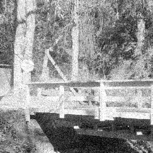
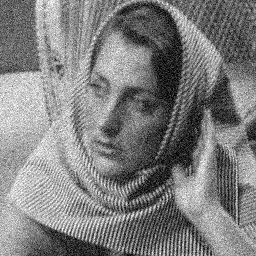

## Problem 1

### Part 1a

| Noisy *barbara* | Denoised *barbara* |
|---|---|
|||

| Noisy *stream* | Denoised *stream* |
|---|---|
|||

**RMSE values**
: - Stream: 0.0774
  - Barbara: 0.0722

### Part 1b

| Noisy *barbara* | Denoised *barbara* |
|---|---|
|||

| Noisy *stream* | Denoised *stream* |
|---|---|
|||

**RMSE values**
: - Stream: 0.0735
  - Barbara: 0.0573

### Part 1c

| Part 1a denoised *barbara* | Part 1b denoised *barbara* | Bilateral denoised *barbara* | 
|---|---|---|
||||

| Part 1a denoised *stream* | Part 1b denoised *stream* | Bilateral denoised *stream* | 
|---|---|---|
||||

**RMSE values**
: - Stream: 0.1028
  - Barbara: 0.1175

**Differences between PCA and Bilateral**
: The bilateral filter with spatial SD = 3, intensity SD = 15 isn’t successful in denoising the image, the image still looks grainy, while the second PCA based approach with K = 200, does a good job in denoising. The first PCA approach doesn’t denoise as much as the second approach but still it looks smoother and less noisy than the Bilateral approach.
  
  PCA approach denoises Gaussian noise better while Bilateral Filter is a spatial-domain filtering which helps in preserving edges while also reducing noise. PCA approach utilizes the fact that the noise present is gaussian and uses its statistical properties while Bilateral filter applies weighted averaging of the pixels where weights are assigned based on spatial and intensity differences. PCA may smoothen out the fine details like edges which are preserved by the Bilateral filter.

### Part 1d

PCA removes the lower components associated with noise. PCA denoising technique utilizes the statistical properties of the noise added, i.e. zero mean Gaussian Noise, if we clamp the values to the range [0, 255], the mean and the variance of the noise added might change, thus leading to fluctuations in the denoising. Thus also shifting the intensity range of the image by an amount proportional to the mean of the noise.

## Problem 2

### Part 2a

If we are given 2 images, $f_1$ and $f_2$ of sizes $N\times N$, that only differ by a translation of $(x_0,y_0)$.
$$
  \therefore f_2(x,y) = f_1(x-x_0,y-y_0)
$$

To find these $(x_0,y_0)$ the paper suggests the following algorithm,
1. Take discrete fourier transforms for both images,
  $$
    F_1(u,v) = \sum_{x=0}^{N-1}\sum_{y=0}^{N-1}f_1(x,y)e^{-2\pi i(ux+vy)/N}\\\
    \\ \\\
    F_2(u,v) = \sum_{x=0}^{N-1}\sum_{y=0}^{N-1}f_2(x,y)e^{-2\pi i(ux+vy)/N}\\\
  $$
  where,
  $$
    F_2(u,v) = e^{-2\pi i(ux_0+vy_0)/N}F_1(u,v)\\\
    \\ \\\
  $$
2. Compute the cross-power spectrum with the 2 Fourier transforms,
  $$
    G(u,v) = \frac{F_1(u,v)\cdot F_2^{\ast}(u,v)}{|F_1(u,v)\cdot F_2(u,v)|} = e^{2\pi i(ux_0+vy_0)/N}\\\
    \\ \\\
  $$
3. Take the discrete Fourier inverse of $G$,
  $$
  \begin{align*}
    g(x,y) & = \frac{1}{N^2}\sum_{u=0}^{N-1}\sum_{v=0}^{N-1}G(u,v)e^{2\pi i(ux+vy)/N}\\\
    \\ \\\
    & = \begin{Bmatrix}
      1 & (-x_0,-y_0)\\\
      0 & \text{otherwise}\\\
    \end{Bmatrix}
  \end{align*}
  $$
4. $g$ will be an impulse image with peak at $(-x_0,-y_0)$ which can be found easily by iterating over $g$.

The complexities for each step described above are,
1. Fast Fourier Transform - $\mathcal{O}(N^2\log N)$
2. Iterating over all values of $(u,v)$ - $\mathcal{O}(N^2)$
3. Fast Inverse Fourier Transform - $\mathcal{O}(N^2\log N)$
4. Iterating over all values of $(x,y)$ - $\mathcal{O}(N^2)$

Hence overall complexity is $\mathcal{O}(N^2\log N)$.

In contrast to the pixel-wise image comparison procedure, where the whole search space of $(x_0,y_0)$ is iterated over and the translation with highest joint entropy is picked, the above algorithm should run superfast. This is because the pixel-wise algorithm has $\mathcal{O}(N^4)$ complexity as compared to the $\mathcal{O}(N^2\log N)$ of the above algorithm.

### Part 2b

If we are given 2 images $f_1$ and $f_2$ with translational and rotation in between them as,
$$
  f_2(x,y) = f_1(x\cos\theta_0+y\sin\theta_0-x_0,-x\sin\theta_0+y\cos\theta_0-y_0)
$$

On taking the Fourier transform on both sides,
$$
  F_2(u,v) = e^{-2\pi i(ux_0+vy_0)}F_1(u\cos\theta_0+v\sin\theta_0,-u\sin\theta_0+v\cos\theta_0)
$$

Let $M_1$ and $M_2$ be the magnitudes of $F_1$ and $F_2$ respecetively.
$$
  \therefore M_2(u,v) = M_1(u\cos\theta_0+v\sin\theta_0,-u\sin\theta_0+v\cos\theta_0)
$$

Coverting to polar co-ordinates where $u=\rho\cos\theta$ and $v=\rho\sin\theta$,
$$
  M_2(\rho,\theta) = M_1(\rho,\theta-\theta_0)
$$

Now $M_1$ and $M_2$ are 2 translated images and this translation can be found using the phase correlation procedure explained in [Part 2a](#part-2a).

## Problem 3

### Part 3a

For any $y\in\R^{n\times 1}$,
$$
\begin{align*}
  y^TPy & =  y^TA^TAy\\\
  & = (Ay)^T(Ay)\\\
  & \ge 0
\end{align*}
$$
Because the norm of $Ay\in\R^{m\times 1}$ is non-negative. If $y$ were to be an eigenvector of $P$ with eigenvalue $\lambda$,
$$
\begin{align*}
  y^TPy & \ge 0\\\
  \lambda y^Ty & \ge 0\\\
  \implies \lambda & \ge 0
\end{align*}
$$

Similarly for any $z\in\R^{m\times 1}$,
$$
\begin{align*}
  z^TQz & = z^TAA^Tz\\\
  & = (A^Tz)^T(A^Tz)\\\
  & \ge 0
\end{align*}
$$

Because the norm of $A^Tz\in\R^{n\times 1}$ is non-negative. If $z$ were to be an eigenvector of $Q$ with eigenvalue $\lambda$,
$$
\begin{align*}
  z^TQz & \ge 0\\\
  \lambda z^Tz & \ge 0\\\
  \implies \lambda & \ge 0
\end{align*}
$$

### Part 3b

For an eigenvector $u\in\R^{n\times 1}$ of $P$,
$$
\begin{align*}
  Pu & = \lambda u\\\
  A^TAu & = \lambda u\\\
  AA^TAu & = \lambda Au\\\
  Q(Au) & = \lambda (Au)
\end{align*}
$$

For an eigenvector $v\in\R^{m\times 1}$ of $Q$,
$$
\begin{align*}
  Qv & = \lambda v\\\
  AA^Tv & = \lambda v\\\
  A^TAA^Tv & = \lambda A^Tv\\\
  P(A^Tv) & = \lambda (A^Tv)
\end{align*}
$$

### Part 3c

Let $\lambda_i$ be the eigenvalue of $Q$ corresponding to $v_i$.
$$
\begin{align*}
  u_i & =\frac{A^Tv_i}{\\|A^Tv_i\\|_2}\\\
  \implies Au_i & =\frac{AA^Tv_i}{\\|A^Tv_i\\|_2}\\\
  & = \frac{Qv_i}{\\|A^Tv_i\\|_2}\\\
  & = \frac{\lambda_i v_i}{\\|A^Tv_i\\|_2}\\\
  & = \gamma_i v_i
\end{align*}
$$
Hence $\gamma_i = \frac{\lambda_i}{\\|A^Tv_i\\|_2}\ge0$ as all eigenvectors of $Q$ are non-negative as well from [Part 3a](#part-3a).

### Part 3d

As defined in the problem statement $U\in\R^{m\times m}$ and $V\in\R^{n\times n}$. For $i,j\in\\\{1,\dots,m\\\}$,
$$
  [U^TU]_{ij} = v_i^Tv_j = \begin{Bmatrix}
    1 & i=j\\\
    0 & i\not ={j}
  \end{Bmatrix}\\\
  \\ \\\
  \implies U^TU=I_m=UU^T\\\
$$

For $i,j\in\\\{1,\dots,n\\\}$,
$$
  [V^TV]_{ij} = u_i^Tu_j = \begin{Bmatrix}
    1 & i=j\\\
    0 & i\not ={j}
  \end{Bmatrix}\\\
  \\ \\\
  \implies V^TV=I_n=VV^T\\\
$$

As per the definition of $V$,
$$
\begin{align*}
  V & = [u_1|u_2|\dots|u_n]\\\
  AV & = [Au_1|Au_2|\dots|Au_n]\\\
\end{align*}\\\
  \\ \\\
\begin{align*}
  \therefore [U^TAV]_{ij} & = v_iAu_j\\\
  & = \gamma_j v_iv_j\\\
  & = \begin{Bmatrix}
    \gamma_j & i=j\\\
    0 & i\not ={j}\\\
  \end{Bmatrix}\\\
\end{align*}\\\
  \\ \\\
\begin{align*}
  \therefore U^TAV & = \Gamma\\\
  A & = U\Gamma V^T
\end{align*}
$$

## Problem 4

For the 2 images taken with different foci, the following relations hold,
$$
  g_1 = f_1 + h_2\ast f_2\\\
  g_2 = h_1\ast f_1 + f_2
$$

On taking Fourier transforms,
$$
  G_1 = F_1 + H_2\cdot F_2\\\
  G_2 = H_1\cdot F_1 + F_2
$$

On solving the 2 equations,
$$
  \\ \\\
  F_1 = \frac{G_1-H_2\cdot G_2}{1-H_2\cdot H_1}\\\
  \\ \\\
  F_2 = \frac{G_2-H_1\cdot G_1}{1-H_1\cdot H_2}\\\
$$

This way we can find $f_1$ and $f_2$ by taking the inverse Fourier transforms.

But all this will only work if $\not\exists u,v$,
$$
  H_1(u,v)\cdot H_2(u,v) = 1\\\
$$
Even if for a single pair of $(u,v)$ the LHS in above equation is close to 1, the whole computation for taking Fourier inverses will become unstable. For most blurring filters $h$ like $h_1$ and $h_2$,
$$
  \int_{-\infty}^\infty\int_{-\infty}^\infty h(x,y)dxdy=1\\\
$$

$$
  H(u,v) = \int_{-\infty}^\infty\int_{-\infty}^\infty h(x,y)e^{-2\pi i(ux+vy)}dxdy\\\
  \\ \\\
  \therefore H(0,0) = 1
$$
Hence at $(0,0)$, $H_1(0,0)\cdot H_2(0,0)$ is likely to be 1, making $f_1$ and $f_2$ unknowable exactly.