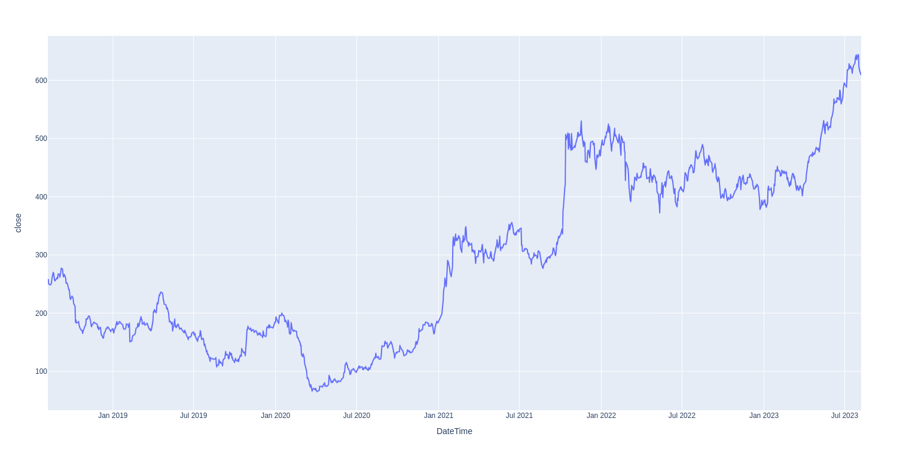
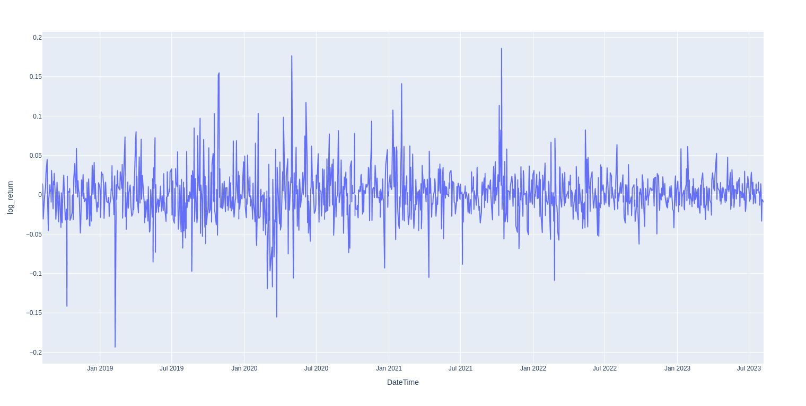
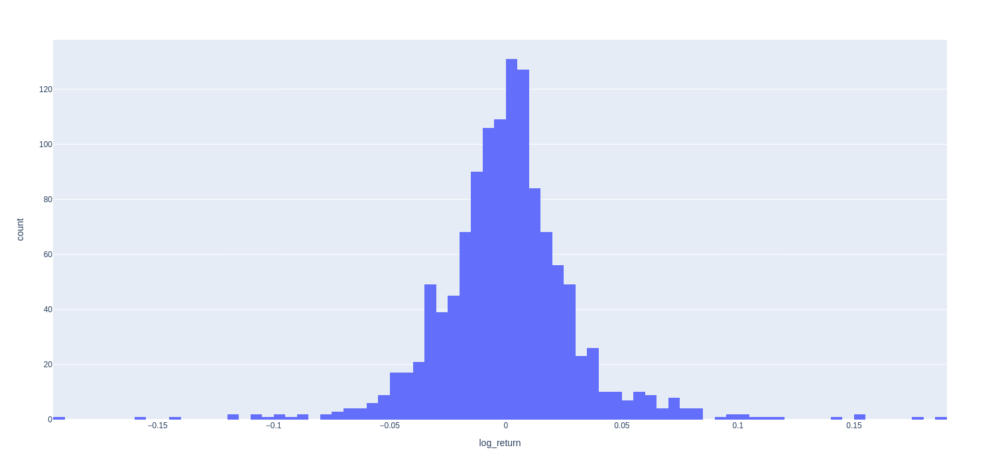

Analysis done on prices of Tata Motors stock price from early Sept 2018 to Sept 2023.

## Summary Statistics

|Statistic|Value|
|---|---|
|Mean|0.000040|
|Stdev|0.030552|
|Min|-0.193375|
|25% Quartile|-0.014307|
|50% Quartile|0.000752|
|75% Quartile|0.014353|
|Max|0.186037|
|Var|0.000933|
|Skewness|0.272770|
|Kurtosis|6.256084|
|Jarque Bera|565.421595|

- Positive skew means longer the returns are more skewed towards right side
- Significant +ve kurtosis means the distribution has thick tails
- Jarque Bera > 6 means returns do not follow a normal distribution

## Prices trend

## Returns trend

## Returns Histogram

