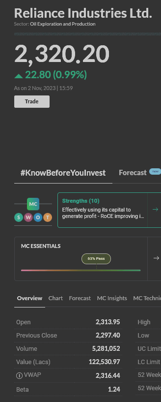
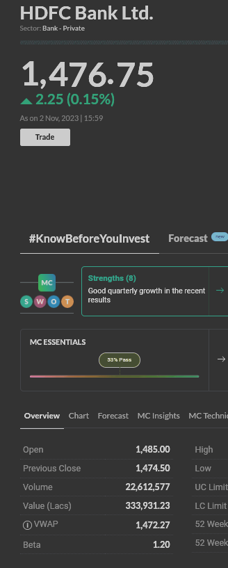
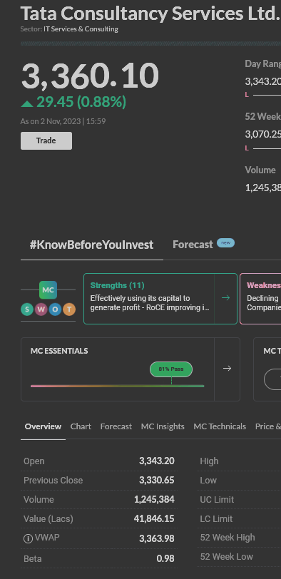

## CAPM

### Assumptions

- Analysis done over returns of RELIANCE, HDFCBANK and TCS by prices from NSE.
- Market returns are taken to be returns of NIFTY-50 index.
- Data is of 10 years from 29th Oct, 2013 to 29th Oct, 2023.

### Results

|Beta estimation|
|---|
||

### Conclusions

- RELIANCE has beta well over 1 implying that it has out-performed the market in the span of 10 years.
- HDFCBANK also has a beta close to 1 meaning it also has generated comparable returns as the market.
- TCS has beta that is smaller than 1 meaning this stock's growth hasn't been as high as the overall market.
- On comparing these betas to the ones reported on [moneycontrol.com](https://moneycontrol.com/), we can see that even if the values (possibly due to different estimate of market returns) don't match the performance trend of RELIANCE > HDFCBANK > TCS still exists.

|RELIANCE|HDFCBANK|TCS|
|---|---|---|
||||