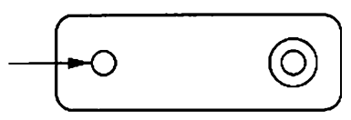
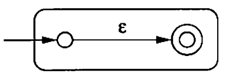
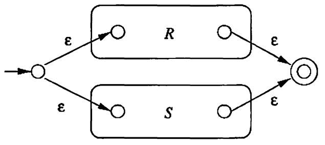
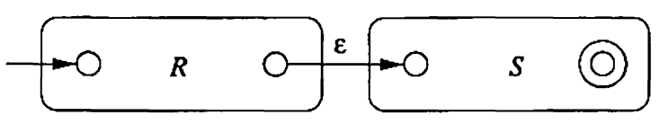
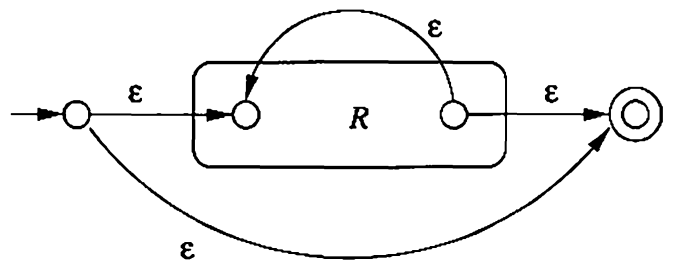

## Resources

- ### [Hopcrot-Motwani-Ullman](https://www-2.dc.uba.ar/staff/becher/Hopcroft-Motwani-Ullman-2001.pdf)

## Central Concepts

#### Alphabets

Alphabet $ (\Sigma) $
: An ***alphabet*** is a finite nonempty set of symbols.

1. $ \Sigma= \\\{1, 0\\\} $
2. $ \Sigma = \\\{a,b,...,z\\\}$

#### Strings

String $(w)$
: A ***string*** is a finite sequence of symbols chosen from $ \Sigma $.

Empty String $(\epsilon)$
: The ***empty string*** is a string with zero symbols.

Length of a string
: $|w|=\\\#$ Symbols in $w$

> $|\epsilon|=0$

Power of Alphabets
:   - $\Sigma^k=\\\{w:|w|=k\\\}$
    - $\Sigma^+=\Sigma^1\cup\Sigma^2\cup...$
    - $\Sigma^*=\Sigma^+\cup\\\{\epsilon\\\}$

> $\Sigma^0= \\\{\epsilon\\\}$

Concatenation of Strings
: For strings $w_1$ and $w_2$, their ***concatenation*** is $w_1w_2$.

> $|w_1w_2| = |w_1|+|w_2|$

#### Languages

Language $(L)$
: A ***language*** over $\Sigma$ is basically $L\sube\Sigma^&ast;$.

> A common way on defining languages is to use set-builder form as,
> $\\\{w\in\Sigma^&ast;:$ something about $w\\\}$.

Empty Language $(\empty)$
: The ***empty language*** contains no words.

> $\empty\ne\\\{\epsilon\\\}$

#### Problems

Problem
: Any ***problem*** is, given a $w$ in $\Sigma^*$, decide whether or not $w$ is in $L$.

> If testing membership in $L_X$ is hard, then compiling programs in programming language $X$ is hard.

## Finite State Automaton

### DFA

Deterministic Finite Automaton $(\mathcal D(Q,\Sigma,\delta,q_0,F) )$
:   1. A finite set of *states* $(Q)$.
    2. A finite set of *input symbols* $(\Sigma)$.
    3. A *transition function* $(\delta:Q\times\Sigma\rightarrow Q)$
    4. A *start state* $(q_0\in Q)$
    5. A set of *final states* $F\sube Q$

Transition diagram $(G_{\mathcal D}(V,E))$
:   1. $V=\\\{q:q\in Q\\\}$
    2. $E=\\\{q_1\xrightarrow{a}q_2:a\in\Sigma\text{ and }\delta(q_1,a)=q_2\\\}$
    3. An arrow pointing into $q_0$.
    4. All nodes in $F$ are denoted with double circle.

Extended transition function $(\hat\delta:Q\times\Sigma^*\rightarrow Q)$
:   - *Basis*: $\hat\delta(q,\epsilon)=q$
    - *Induction*: $\hat\delta(q,w)=\delta(\hat\delta(q,w[:-1]),w[-1])$

Language of DFA $(L(\mathcal D))$
:   $$
        L(\mathcal D)=\\\{w\in\Sigma:\hat\delta(q_0,w)\in F\\\}
    $$

### NFA

Nondeterministic Finite Automaton $(\mathcal N(Q,\Sigma,\delta,q_0,F) )$
:   1. A finite set of *states* $(Q)$.
    2. A finite set of *input symbols* $(\Sigma)$.
    3. A *transition function* $(\delta:Q\times\Sigma\rightarrow\mathcal P(Q))$
    4. A *start state* $(q_0\in Q)$
    5. A set of *final states* $F\sube Q$

> $\mathcal P(S)=\\\{A:A\sube S\\\}$

Extended transition function $(\hat\delta:Q\times\Sigma^*\rightarrow P(Q))$
:   - *Basis*: $\hat\delta(q,\epsilon)=\\\{q\\\}$
    - *Induction*: $\hat\delta(q,w)=\bigcup_{p\in \hat\delta(q,w[:-1])}\delta(p,w[-1])$

Language of NFA $(L(\mathcal N))$
:   $$
        L(\mathcal N)=\\\{w\in\Sigma:\hat\delta(q_0,w)\cap F\ne\empty\\\}
    $$

#### Equivalence of DFA and NFA

Given an NFA $(\mathcal N=\\\{Q_N,\Sigma,\delta_N,q_0,F_N\\\})$ it can be converted to a DFA $\mathcal D=\\\{Q_D,\Sigma,\delta_D,\\\{q_0\\\},F_D\\\}$ such that $L(\mathcal D)=L(\mathcal N)$ using ***subset construction*** method.

1. $Q_D=P(Q_N)$
2. $F_D=\\\{S\sube Q_N:S\cap F_N\ne\empty\\\}$
3. $\delta_D:P(Q_N)\times\Sigma\rightarrow P(Q_N)$ is defined as,
$$
    \delta_D(S,a)=\bigcup_{p\in S}\delta_N(p,a)
$$

##### **Theorem** : $L(\mathcal D)=L(\mathcal N)$ i.e. $\forall w\in\Sigma,\\\ \hat\delta_D(\\\{q_0\\\},w)=\hat\delta_N(q_0,w)$
Proof
:   - *Basis*: For $w=\epsilon,\\\ \hat\delta_D(\\\{q_0\\\},w)=\\\{q_0\\\}$ and $\hat\delta_N(q_0,w)=\\\{q_0\\\}$
    - *Induction*: As $\hat\delta_N(q_0,w[:-1])=\hat\delta_D(\\\{q_0\\\},w[:-1])$
    $$
        \hat\delta_N(q_0,w)=\bigcup_{p\in\hat\delta_N(q_0,w[:-1])}\delta_N(p,w[-1])
    $$
    $$
        \hat\delta_D(\\\{q_0\\\},w)=\delta_D(\hat\delta_D(\\\{q_0\\\},w[:-1]),w[-1])=\bigcup_{p\in\hat\delta_D(\\\{q_0\\\},w[:-1])}\delta_N(p,w[-1])
    $$
    $$
        \therefore\hat\delta_D(\\\{q_0\\\},w)=\hat\delta_N(q_0,w)
    $$

##### **Theorem** : A language $L$ is accepted by some DFA iff $L$ is accepted by some NFA.

> A bad case for subset construction is $L=\\\{w\in\\\{1,0\\\}^*:w[-n]=1\\\}$

### $\epsilon$-NFA

Finite Automaton with $\epsilon$-transition $(\mathcal A(Q,\Sigma,\delta,q_0,F))$
: It is defined similar to the NFA with only difference in $\delta:Q\times\Sigma\cup\\\{\epsilon\\\}\rightarrow P(Q)$.

Epsilon Closure $(\text{Ecl}(.))$
:   - *Basis*: $q\in\text{Ecl}(q)$
    - *Induction*: If $p\in\text{Ecl}(q)$ and $r\in\delta(p,\epsilon)$ then $r\in\text{Ecl}(q)$

Extended Transition Function $(\hat\delta(.,.))$
:   - *Basis*: $\hat\delta(q,\epsilon)=\text{Ecl}(q)$
    - *Induction*: $$\hat\delta(q,w)=\bigcup_{r\in\bigcup_{p\in\hat\delta(q,w[:-1])}\delta(p,w[-1])}\text{Ecl}(r)$$

#### Eliminating $\epsilon$-transitions

Given an $\epsilon$-NFA $\mathcal A=\\\{Q_A,\Sigma,\delta_A,q_0,F_A\\\}$ it can be converted to a DFA $\mathcal D=\\\{Q_D,\Sigma,\delta_D,\\\{q_D\\\},F_D\\\}$ such that $L(\mathcal D)=L(\mathcal A)$ as follows,

1. $Q_D=\mathcal P(Q_A)$
2. $q_D=\text{Ecl}(q_0)$
3. $F_D=\\\{S:S\in Q_D$ and $S\cap F_A\ne\empty\\\}$
4. $\delta_D:Q_D\times\Sigma$ is defined as follows,
$$
    \delta_D(S,a)=\bigcup_{r\in\bigcup_{p\in S}\delta_A(p,a)}\text{Ecl}(r)
$$

##### **Theorem** : A language $L$ is accepted by some $\epsilon$-NFA iff $L$ is accepted by some DFA.

Proof
: Use the above procedure to create a DFA.
   - *Basis*: Since $\hat\delta_A(q_0, \epsilon)=\text{Ecl}(q_0)$ and $\hat\delta_D(q_D, \epsilon)=\hat\delta_D(\text{Ecl}(q_0),\epsilon)=\text{Ecl}(q_0)$, $\hat\delta_A(q_0, \epsilon) = \hat\delta_D(q_D, \epsilon)$ 
    - *Induction*: As $\hat\delta_A(q_0, w[:-1])=\hat\delta_D(q_D,w[:-1])$ and,
$$
    \hat\delta_A(q_0,w)=\bigcup_{r\in\bigcup_{p\in\hat\delta_A(q_0, w[:-1])}\delta_A(p,w[-1])}\text{Ecl}(r)
$$
and $\hat\delta_D(q_D,w)$ is defined in a similar way,
$$
    \therefore\hat\delta_A(q_0, w)=\hat\delta_D(q_D,w)
$$

## Regular Expressions

Operators on Regular Languages

Union $(\cup)$
: The union of two languages $L$ and $M$ is defined as $L\cup M$.

Concatenation $(\cdot)$
: The concatenation of two languages $L$ and $M$ is defined as $LM=\\\{x\cdot y\text{ or }xy:x\in L,y\in M\\\}$.

Kleene closure $(^{&ast;})$
: The Kleene closure of a language $L$ is defined inductively as,
    - *Basis*: $\epsilon\in L^&ast;$
    - *Induction*: If $w\in L^&ast;$ and $x\in L$ then, $wx\in L^&ast;$

RegEx $(\boldsymbol R)$
:   - *Basis*: It contains 2 parts:
        1. The constants $\boldsymbol{\epsilon}$ and $\boldsymbol{\empty}$ are regex such that $L(\boldsymbol{\epsilon})=\\\{\epsilon\\\}$ and $L(\boldsymbol{\empty})=\empty$
        2. Every symbol $\boldsymbol{a}$ such that $a\in\Sigma$ is a regex then $L(\boldsymbol{a})=\\\{a\\\}$
    - *Induction*: There are four parts for the induction step:
        1. $L(\boldsymbol E+\boldsymbol F)=L(\boldsymbol E)\cup L(\boldsymbol F)$
        2. $L(\boldsymbol E\boldsymbol F)=L(\boldsymbol E)L(\boldsymbol F)$
        3. $L(\boldsymbol E^&ast;)=(L(\boldsymbol E))^&ast;$
        4. $L((\boldsymbol E))=L(\boldsymbol E)$

> $&ast; > . > +$

### Equivalence to Finite Automata

#### DFA to RegEx

##### **Theorem**: If $L=L(\mathcal D)$ for some DFA $\mathcal D$, then there is a regular expression $\boldsymbol R$ such that $L=L(\boldsymbol R)$

Proof
: Let the DFA have $n$ nodes each labelled with a number from $[1,n]$.

> $\boldsymbol R_{ij}^{(k)}=\\\{w:\hat\delta(i,w)=j$ and $\forall t$ such that $0<t<|w|-1,\ \hat\delta(i,w[:t])\le k\\\}$

- *Basis*: Let $S=\\\{a:\delta(i,a)=j\\\}$. If $S=\empty$ then $\boldsymbol R_{ij}^{(0)}=\empty$ else $\boldsymbol R_{ij}^{(0)}=\sum_{a\in S}a$
- *Induction*:
    $$
        \boldsymbol R_{ij}^{(k)}=\boldsymbol R_{ij}^{(k-1)} + \boldsymbol R_{ik}^{(k-1)}\cdot(\boldsymbol R_{kk}^{(k-1)})^&ast;\cdot\boldsymbol R_{kj}^{(k-1)}
    $$

#### RegEx to Automata

##### **Theorem**: Every language accepted by a regular expression is also accepted by a finite automaton.

Proof
: Let $L=L(\boldsymbol R)$ for some regular expression $\boldsymbol R$. We show that $L=L(\mathcal A)$ for some $\epsilon$-NFA $\mathcal A$ with:
1. Exactly one accepting state.
2. No arcs into the initial state.
3. No arcs out of the accepting state.

- *Basis*: For the 3 base cases:
  1. $\boldsymbol \empty$
        
        
  
  2. $\boldsymbol \epsilon$
        
        
  
  3. $\boldsymbol a\in\Sigma$
        
        
  
- *Induction*: 
  1. $\boldsymbol R+\boldsymbol S$
        
        
  
  2. $\boldsymbol R\boldsymbol S$
        
        
  
  3. $\boldsymbol R^{&ast;}$
        
        

### Algebraic Laws

#### Associativity and Commutativity

- $L+M=M+L$
- $(L+M)+N=L+(M+N)$
- $(LM)N$=$L(MN)$

#### Identities and Annihilators

- $\empty+L=L+\empty=L$
- $\epsilon L=L\epsilon=L$
- $\empty L=L\empty=\empty$

#### Distributive Laws

- $L(M+N)=LM+LN$
- $(M+N)L=ML+NL$

#### Idempotent Law

- $L+L=L$

#### Laws with Closure

- $(L^&ast;)^&ast;=L^&ast;$
- $\empty^&ast;=\epsilon$
- $\epsilon^&ast;=\epsilon$
> $L^+=LL^&ast;$
- $L^&ast;=L^++\epsilon$
> $L?=\epsilon+L$
- $(L^&ast;M^&ast;)^&ast;=(L+M)^&ast;$

## Properties of RLs

### Pumping Lemma for RLs

#### Statement of PPumping Lemma

##### **Theorem**: For all $L$ such that $L$ is a regular language, there exists a constant $n$ such that for all $|w|\ge n$ we can break $w$ into three strings, $w=xyz$, such that:
##### 1. $y\ne\epsilon$
##### 2. $|xy|\le n$
##### 3. $\forall k\ge0,xy^kz\in L$

Proof
:   Let $L=L(\mathcal D)$ be a regular language for DFA $\mathcal D$. Consider a $w$ such that $|w|\ge n$.
    We define,
    $$
        S = \\\{q
        _i:0\le i\le n,\hat\delta(q_0,w[:i])=q_i\\\}
    $$
    As size of $S$ is $n+1$ there must be two $q_i$ and $q_j$ such that $q_i=q_j$ by Pigeon-hole principle. We can break $w$ as,
    1. $x=w[:i]$
    2. $y=w[i:j]$
    3. $z=w[j:]$

#### Proving languages not to be Regular

We do a game between 2 players as follows:
1. Player 1 picks the language $L$ to be proved nonregular.
2. Player 2 picks $n$, but doesn't reveal to player 1 what $n$ is; player 1 must devise a play for all possible $n$'s.
3. Player 1 picks $w$, which may depend on $n$ and which must be of length at least $n$ and $w\in L$.
4. Player 2 divides $w$ into $x$, $y$ and $z$, obeying the constraints that are stipulated in the pumping lemma; $y\ne\epsilon$ and $|xy|\le n$ and doesn't tell player 1 what $x$, $y$ and $z$ are.
5. Player 1 "wins" by picking $k$, which may be a function of $n$, $x$, $y$ and $z$, such that $xy^kz$ is not in $L$.

Thus $L$ must not be regular as it doesn't follow the pumping lemma.

### Closure Properties

#### Closure under Boolean Operations

> $\boldsymbol R_L =$ regular expression for language $L$

##### **Theorem**: If $L$ and $M$ are regular then $L\cup M$ is also regular.
Proof
: $L\cup M=L(\boldsymbol R_L+\boldsymbol R_M)$

##### **Theorem**: If $L$ is regular then so is $\bar L$.
Proof
: Convert $\boldsymbol R_L$ to DFA and take complement of it and construct the regular expression again to get $\boldsymbol R_{\bar L}$

##### **Theorem**: If $L$ and $M$ are regular then $L\cap M$ is also regular.
Proof
: $L\cap M=\overline{\overline L\cup\overline M}$

##### **Theorem**: If $L$ and $M$ are regular then $L-M$ is also regular.
Proof
: $L-M=L\cap\overline M$

#### Reversal

> $L^R$ is defined as the reversal of the language $L$.

##### **Theorem**: If $L$ is regular language then so is $L^R$.

Proof
: Construct the DFA $\mathcal D$ of $L$ and reverse all the edges of $\mathcal D$ and make final states as start states and start states as end states. This will make an NFA accepting only reverse of string in $L$.

### Descision Properties

#### Converting among Representations

- NFA to DFA: $\mathcal O(n^32^n)$
- DFA to NFA: $\mathcal O(n)$
- DFA to RegEx: $\mathcal O(n^34^n)$
- NFA to RegEx: $\mathcal O(n^34^{n^32^n})$
- RegEx to $\epsilon$-NFA: $\mathcal O(n^3)$

#### Testing Emptiness of Regular Languages

Given a DFA apply BFS to check if any final state is reachable from the start state.

For a Regular Expression,
- *Basis*: $\empty$ is the empty language.
- *Induction*: Four cases must be considered:
  1. $R=R_1+R_2$ then $L(R)$ is empty iff both $L(R_1)$ and $L(R_2)$ are empty.
  2. $R=R_1R_2$ then $L(R)$ is empty iff $L(R_1)$ or $L(R_2)$ is empty.
  3. $R=R_1^&ast;$ then $L(R)$ is not empty.
  4. $R=(R_1)$ then $L(R)$ is empty iff $L(R_1)$ is empty.

#### Testing Membership in a Regular Language

For a string $w$ with $|w|=n$ and $s$ states,
- DFA: $\mathcal O(n)$
- $\epsilon$-NFA: $\mathcal O(ns^2)$
- RegEx: $\mathcal O(ns^2)$

### Equivalence and Minimization

Equivalent States $(p,q)$
: For all input strings $w$, $\hat\delta(p,w)$ is an accepting state iff $\hat\delta(q,w)$ is an accepting state.

#### Testing Equivalence of States

Finding all pairs of distinguishable states by table method.
- *Basis*: If $p$ is an accepting state and $q$ is a nonaccepting, then the pair $\\\{p,q\\\}$ is distinguishable.
- *Induction*: Let $r=\delta(p,a)$ and $s=\delta(q,a)$ then $p$ and $q$ are distinguishable if $r$ and $s$ are known to be distinguishable.

##### **Theorem**: Any pair that is left indistinguishable from the table-filling algorithm is equivatent.

#### Minimization of DFA's

##### **Theorem**: The equivalence of states is transitive. That is, if in some DFA $\mathcal D=(Q,\sum,\delta,q_0,F)$ we find that states $p$ and $q$ are equivalent, and we also find that $q$ and $r$ are equivalent, then it must be that $p$ and $r$ are equivalent.

Therefore the "equivalence of states" is an equivalence relation over $Q$. This means we can divide the $Q$ into different equivalence classes and the minimal DFA needs to have at least these many states representing each equivalence class.

## Context-free Grammars

CFG $(\mathcal G(V,T,P,S))$
:   - ***Terminals*** $(T\sube\\\{a,\cdots,z\\\})$
    : Set of symbols of the language being defined.
    - ***Variables*** $(V\sube\\\{A,\cdots,Z\\\})$
    : Aka nonterminal or syntactic categories; Set of finite variables that each represent a language.
    - ***Start Symbol*** $(S)$
    : A special variable which represents the required language.
    - ***Rules*** $(P)$
    : A set of rules describing recursive definitions of variables such that,
    $$
        P\sube\\\{A_0\rightarrow w_0|A_0\in V\text{ and }w_0\in(T\cup V)^&ast;\\\}
    $$

Derivation Relation $(\Rightarrow)$
:   $$
        R_{\boldsymbol{\Rightarrow}}=\\\{(\alpha A\beta,\alpha\gamma\beta)|A\rightarrow\gamma\in P\\\}
    $$
    So in short $\alpha A\beta\Rightarrow\alpha\gamma\beta$.

Extended Derivation Relation $(\xRightarrow{&ast;})$
:   We can extend the above relation to a more powerful "derivation in multiple steps" relation $\xRightarrow{&ast;}$ as,
    - *Basis*: For any string $\alpha$, $\alpha\xRightarrow{&ast;}\alpha$
    - *Induction*: If $\alpha\xRightarrow{&ast;}\beta$ then $\beta\Rightarrow\gamma$ then $\alpha\xRightarrow{&ast;}\gamma$

Leftmost Derivation
: While deriving the leftmost string that occurs in a rule as head is always substituted first. This gives use new relations $\xRightarrow[lm]{}$ and $\xRightarrow[lm]{&ast;}$.

Rightmost Derivation
: Similarly we can also define the relations $\xRightarrow[rm]{}$ and $\xRightarrow[rm]{&ast;}$

Language of a Grammar
:   The language $L$ given by a CFG $\mathcal G$ is defined as,
    $$
        L(\mathcal G) = \\\{w\in T^{&ast;}| S\xRightarrow[\mathcal G]{&ast;}w\\\}
    $$

Sentential Forms
: All the strings $\alpha\in(V\cup T)^{&ast;}$ such that $S\xRightarrow{&ast;}\alpha$ are sentential form.

Similar we can define ***right-sentential form*** and ***left-sentential form***.

### Parse Trees

Parse Trees
: For a grammar $\mathcal G$ the parse tree is defined as,
    1. Each interior node is labelled by a variable in $V$.
    2. Each leaf is either labelled by a variable or a terminal or $\epsilon$. If a leaf has $\epsilon$ as label then it must be an only child.
    3. If an interior node is labeled $A$ and its children are labeled
    $$
        X_1,X_2,\dots,X_k
    $$
    then $A\rightarrow X_1X_2\dots X_k\in P$ and $A$ can have $\epsilon$ as child only if $A\rightarrow\epsilon\in P$.

Yield
: For a particular parse tree, the string obtained by joining the labels of the leafs in the parse tree.

More important parse trees are the ones where:
- Yield is a terminal string.
- Root is labeled by the start symbol. 

#### Inference, Derivation and Parse Trees

While describing a grammar $G$ and a string $w$ the following 5 are equivalent,

1. The recursive inference procedure determines that terminal string $w$ is in th language $A$.
2. $A\xRightarrow{&ast;}w$
3. $A\xRightarrow[lm]{&ast;}e$
4. $A\xRightarrow[rm]{&ast;}e$
5. There is a parse tree with root $A$ and yield $w$.

#### Inference to Trees

##### **Theorem** : If a recursive inference procedure gives that terminal string $w$ is in the language of variable $A$, then there is a parse tree with root $A$ and yeild $w$.

Proof
:   Induction on the number of steps to infer that $w$ is in $A$.
    - Basis: In a single step, inference procedure gets to $w$ from $A$. Thus, there must be a $A\rightarrow w\in P$. Therefore in the parse tree rooted at $A$ we can get the yield as $w$.
    - Induction: Let the fact $w$ in the language of $A$ be infered after $n+1$ steps and that the hypothesis for all inferences with $\le n$ steps.

    Let $A\rightarrow X_1X_2\cdots X_k$ be a rule used to expand $A$ in the inference. Break $w=w_1w_2\cdots w_k$ such that
    1. If $X_i$ is terminal then $w_i=X_i$
    2. If $X_i$ is variable then by induction hypothesis there exist a tree rooted at $X_i$ and yield $w_i$.

    Now we construct the tree rooted at $A$ by adding $X_1,X_2,\dots,X_k$ as level one children and their trees as described above below them. Thus the yeild of this tree is $w$.

#### Trees to derivations

##### **Theorem** : Suppose there is a parse tree root labeled by variable $A$ and with yield $w$ where $w$ is in $T^{&ast;}$. Then there is a leftmost derivation $A\xRightarrow[lm]{&ast;}w$ in grammar $G$.

Proof
: On performing induction on the height of the tree. Similar to above proof.

#### Derivations to Inferences

##### **Theorem** : If there is a derivation $A\xRightarrow[G]{&ast;}w$ for $w\in T^{&ast;}$ then recursive inference procedure applied to $G$ determines that $w$ is in the language of $A$.

Proof
: On performing induction on the length of the derivation $A\xRightarrow{&ast;}w$. Similar to above proof.

## Push-down Automaton

Pushdown Automaton $(\mathcal P(Q,\Sigma,\Gamma,\delta,q_0,Z_0,F) )$
:   1. A finite set of *states* $(Q)$.
    2. A finite set of *input symbols* $(\Sigma)$.
    3. A finite *stack alphabet* that can be push onto the stack $(\Gamma)$
    4. A *transition function* $(\delta:Q\times\Sigma\cup\\\{\epsilon\\\}\times\Gamma\rightarrow\mathcal P(Q\times\Gamma^{&ast;}))$ such that $(p,\gamma)\in\delta(q,a,X)$ means that on the input symbol $a$ we go from $q$ to $p$ and change the top of the stack from symbol $X$ to string $\gamma$
    5. A *start state* $(q_0\in Q)$
    6. The *stack start symbol* $(Z_0)$ that is empty stack has this at the top initially
    7. A set of *final states* $F\sube Q$

Transition Diagram $(G(V,E))$
:   1. $V=\\\{q:q\in Q\\\}$
    2. An arrow pointing into $q_0$
    3. Double circle around states in $F$
    4. $E=\\\{q\xrightarrow{a,X/\gamma}p:(p,\gamma)\in\delta(q,a,X)\\\}$

Instantaneous Description $(ID=(q,w,\gamma))$
:   1. $q$ is the state
    2. $w$ is the remaining input
    3. $\gamma$ is the stack contents

Transition Relation $(\vdash\sube(ID)^2)$
:   If $(p,\alpha)\in\delta(q,a,X)$ then, $\forall w\in\Sigma^{&ast;},\forall\beta\in\Gamma^{&ast;}$
    $$
        (q,aw,X\beta)\vdash(p,w,\alpha\beta)
    $$

Generalised Transition Relation $(\vdash^{&ast;})$
:   - *Basis*: $I\vdash^{&ast;}I$ for all $ID\text{s}$
    - *Induction*: If $I\vdash K$ and $K\vdash^{&ast;}J$ then $I\vdash^{&ast;}J$

##### **Theorem** : If $(q,x,\alpha)\vdash^{&ast;}(p,y,\beta)$, then for any strings $w$ in $\Sigma^{&ast;}$ and $\gamma$ in $\Gamma^{&ast;}$, it is also true that $(q,xw,\alpha\gamma)\vdash^{&ast;}(p,yw,\beta\gamma)$

##### **Theorem** : If $(q,xw,\alpha)\vdash^{&ast;}(p,yw,\beta)$ then $(q,x,\alpha)\vdash^{&ast;}(p,y,\beta)$

### Language of a PDA

#### Acceptance by Final State
$$
    L(P) = \\\{w|(q_0,w,Z_0)\vdash^{&ast;}(q,\epsilon,\alpha)\\\}
$$

## Properties of CFLs

### Normal Forms of CFGs

Every CFL can be converted to it's normal form by,
1. Eliminate all the *useless symbols* i.e. those variables or terminals that do not appear in any derivation of a terminal string from the start symbol.
2. Eliminate all $\epsilon$*-productions*, those of the form $A\rightarrow\epsilon$ for some variable $A$.
3. Eliminate unit productions those of the fom $A\rightarrow B$ of variables $A$ and $B$.

#### Eliminating Useless Symbols

Useful Symbol
: A symbol $X\in T\cup V$ such that $S\xRightarrow{&ast;}\alpha X\beta\xRightarrow{&ast;}w$ where $w\in T^{&ast;}$.

A useful symbol has to be both of the following things,

Generating
: A symbol $X$ is generating if $X\xRightarrow{&ast;}w$ for some terminal string $w$.

Reachable
: A symbol $X$ is reachable if there is a derivation $S\xRightarrow{&ast;}\alpha X\beta$ for some $\alpha$ and $\beta$.

##### **Theorem** : Let $\mathcal G$ be a CFG and assuming $L(\mathcal G)\ne\empty$ and $\mathcal G_1$ be the grammar we obtain by eliminating,
##### 1. All non-generating symbols and productions involving any of these symbols.
##### 2. All unreachable symbols.
##### Thus $\mathcal G_1$ has no useless symbols then $L(\mathcal G)=L(\mathcal G_1)$.

Proof
:   To show that $L(\mathcal G_1)=L(\mathcal G)$ we need to prove,
    - $L(\mathcal G_1)\sube L(\mathcal G)$: Since we have only eliminated symbols and productions from $\mathcal G$ to get $\mathcal G_1$ it follows that $L(\mathcal G_1)\sube L(\mathcal G)$.

    - $L(\mathcal G)\sube L(\mathcal G_1)$: If $w$ is in $L(\mathcal G)$, then $S\xRightarrow[\mathcal G]{&ast;}w$. Each symbol in this derivation is evidently both reachable and generating, so it also a derivation of $\mathcal G_1$. Thus, $S\xRightarrow[\mathcal G_1]{&ast;}w$ i.e. $w\in L(\mathcal G_1)$.

#### Computing Generating and Reachable symbols

For computing the **generating symbols** we use the following algorithm,
- *Basis*: Every symbols in $T$ is obviously generating; it generates itself.
- *Induction*: Suppose there is a production $A\rightarrow\alpha$, and every symbols of $\alpha$ is already known to be generating. Then $A$ is generating.

For computing the **reachable symbols** we use the following algorithm,
- *Basis*: $S$ is surely reachable.
- *Induction*: Suppose $A$ is reachable and there is a production $A\rightarrow\alpha$, then all symbols in $\alpha$ are reachable.

#### Eliminating $\epsilon$-Productions

We have to prove is $L$ has a CFG then $L-\\\{\epsilon\\\}$ also has a CFG. But simply removing all productions that lead to $\epsilon$ may leave out certain words from the language. Thus we define the following procedure.

Nullable
: A variable $A$ is nullable if $A\xRightarrow{&ast;}\epsilon$.

Algorithm to identify all the nullable variables,
- *Basis*: If $A\rightarrow\epsilon$ is a production of $G$, then $A$ is nullable.
- *Induction*: If there is a production $B\rightarrow C_1C_2\cdots C_k$ where each $C_i$ is nullable, then $B$ is nullable. Note that all $C_i$ have to be variables.

Once all the nullable symbols have been determined, we construct a new grammar $\mathcal G_1$ whose set of productions $P_1$ is modified as follows.
For a production $A\rightarrow X_1X_2\cdots X_k$ of $P$, where $k\ge1$, suppose that $m$ of the $k$ $X_i$'s are nullable symbols. We add all $2^m$ possible combinations of this production in $P_1$, where the nullable $X_i$'s, in all possible combinations are present or absent. When $m=k$ i.e. all symbols $X_i$'s are nullable then we do not include the case where all symbols are absent.

##### **Theorem**: If grammar $\mathcal G_1$ constructed from $\mathcal G$ by the above construction for eliminating $\epsilon$-productions, then $L(\mathcal G_1)=L(\mathcal G)-\\\{\epsilon\\\}$

Proof
:   By inducting of the length of the derivation we can prove,
    $$
        A\xRightarrow[\mathcal G_1]{&ast;}w\iff A\xRightarrow[\mathcal G]{&ast;}w\text{ and }w\ne\epsilon
    $$

#### Eliminating Unit Productions

Algorithm to identify all unit pairs,
- *Basis*: $(A,A)$ is a unit pair for any variable $A$. That is, $A\xRightarrow{&ast;}A$ by zero steps.
- *Induction*: suppose we have determined that $(A,B)$ is a unit pair, and $B\rightarrow C$ is a production, where $C\in V$ then $(A,C)$ is a unit pair.

To eliminate all unit productions, we proceed by creating a new grammar $\mathcal G_1$ as follows,
1. Find all the unit pairs of $\mathcal G$.
2. For each unit pair $(A,B)$, add to $P_1$ all the productions $A\rightarrow\alpha$, where $B\rightarrow\alpha$ is a non-unit production in $P$.

##### **Theorem** : If grammar $\mathcal G_1$ is constructed from grammar $\mathcal G$ by the algorithm described above for eliminating unit productions, then $L(\mathcal G_1)=L(\mathcal G)$.

#### Chomsky Normal Form

We can show that every CFL (without $\epsilon$) can be generated by a CFG in which all productions are of the form,
- $A\rightarrow BC$
- $A\rightarrow a$

To convert a normalized CFG to it's Chomsky form,
1. Arrange all the bodies of length 2 or more so that they only contain variables. Thus if a terminal is present in add a new variable.
2. Break bodies of length 3 or more into a cascade of productions, each with body of 2 variables.

##### **Theorem** : If $\mathcal G$ is a CFG whose language contains at least one string other than $\epsilon$, then there is a grammar $\mathcal G_1$ in Chomsky Normal Form, such that $L(\mathcal G_1)=L(\mathcal G)-\\\{\epsilon\\\}$

### Pumping Lemma for CFLs

#### Size of Parse Tree

> For a grammar $\mathcal G$ in Chomsky Nornal Form, a parse tree with longest path $n$ and yield $w$, $|w|\le 2^{n-1}$

#### Statement of Pumping Lemma

##### **Pumping Lemma for context-free languages** : Let $L$ be a CFL. Then there exists a constant $n$ such that if $z$ is any string in $L$ such that $|z|$ is at least $n$, then we can write $z=uvwxy$ such that,
##### 1. $|vwx|\le n$
##### 2. $vx\ne\epsilon$
##### 3. For all $i\ge0$, $uv^iwx^iy\in L$

#### Applications of Pumping Lemma

Can be used to disprove a language being CFL by the following game,
1. Player 1 picks a language $L$ that we want to show is not CFL.
2. Player 2 picks an unknown $n$.
3. Player 1 picks a $z$ based on $n$ as parameter.
4. Player 2 breaks $z$ into $uvwxy$, such that $|vwx|\le n$ and $vx\ne\epsilon$.
5. Player 1 wins if they can pick an $i$ and show that $uv^iwx^iy$ is not in $L$.

### Closure Properties

Substitution $s:\Sigma\rightarrow\mathcal P(\Sigma_1^&ast;)$
:   For every symbol $a\in\Sigma$, $s(a)=L_a$ where $L_a$ is a language on $\Sigma_1$ Similarly for a word $w\in\Sigma^&ast;$
    - *Basis*: If $w=\epsilon$ then $s(\epsilon)=\epsilon$
    - *Induction*: $s(w)=s(w[:-1])\cdot s(w[-1])$

#### Substitution Theorem

##### **Theorem**: If $L$ is a CFL over $\Sigma$ and $s$ is a substitution on $\Sigma$ such that $s(a)$ is a CFL for each $a\in\Sigma$, then $s(L)$ is a CFL.

Proof
: In any Parse tree of a grammar $\mathcal G$ of the original
language $L$, we replace the terminal symbols by the roots of parse trees of the language substituted at that terminal. This way a string $w$ in in $L(\mathcal G')$ iff $w$ is in $s(L)$.

#### Applications of the Substitution Theorem

##### **Theorem**: All CFLs are closed under the following operations:-
1. Union
    Proof: $L_1$ and $L_2$ be CFLs. Then $L_1\cup L_2$ is the language $s(L)$ where $L$ is the language $\\\{0,1\\\}$ and $s$ is the substitution defined by $s(1)=L_1$ and $s(0)=L_2$.
2. Concatenation
    Proof: $L=\\\{01\\\}$, $s(1)=L_1$, $s(0)=L_2$
3. Closure
    Proof: $L=\\\{1\\\}^&ast;$, $s(1)=L_1$
4. Homomorphism
    Proof: $s(a)=\\\{h(a)\\\}\forall a\in\Sigma$ then $h(L)=s(L)$ where $h:\Sigma\rightarrow\Sigma$

#### Reversal

##### **Theorem**: If $L$ is a CFL then so is $L^R$.

Proof
: If $\mathcal G$ is the grammar for $L$ then $\mathcal G^R=(V,T,P^R,S)$ is the grammar for $L^R$ where,
    $$
        P^R=\\\{A\rightarrow\alpha^R:A\rightarrow\alpha\in P\\\}
    $$

#### Intersection with Regular Language

##### **Theorem**: If $L$ is a CFL and $R$ is a RL then $L\cap R$ is a CFL.

Proof
: Involves PDA :(

### Descision Properties

## Turing Machines

Turing Machine $M(Q, \Sigma, \Gamma, \delta, q_0, B, F)$
:   - $Q$: Finite set of states of finite control
    - $\Sigma$: Finite set of input symbols
    - $\Gamma$: Complete set of tape symbols; $\Sigma$ is always a subset of $\Gamma$ and $\Sigma\sube\Gamma$
    - $\delta$: Transition funtion such that $\delta: Q\times\Gamma\rightarrow Q\times\Gamma\times\\\{L,R\\\}$ and if $\delta(p, X)=(q, Y, L/R)$ means
        - Control state goes from $p$ to $q$
        - Current tape symbol $X$ is replaced by $Y$
        - Tape is shifted towards left/right based on L/R.
    - $q_0$: The start state thus $q_0\in Q$
    - $B$: The blank symbol thus $B\in\Gamma$
    - $F$: The set of final accepting states thus $F\sube Q$

Instantaneous Description $ID(X_1X_2\cdots X_{i-1}qX_i\cdots X_n)$
:   - $q$ is the state of the Turing machine
    - Tape is scanning the $i\text{th}$ symbol from the left
    - $X_1X_2\cdots X_n$ is the portion of the tape between the leftmost and the rightmost non-blank.

Moves $(\vdash$ or $\vdash^{&ast;})$
: If $\delta(q,X_i)=(p,Y,\alpha)$
    - $\alpha=L$
        $$
            X_1X_2\cdots X_{i-1}qX_i\cdots X_n\vdash X_1\cdots X_{i-2}pX_{i-1}Y\cdots X_n
        $$
    - $i=1$ and $\alpha=L$
        $$
            qX_1\cdots X_n\vdash pBYX_2\cdots X_n
        $$
    - $i=n$, $Y=B$ and $\alpha=L$
        $$
            X_1\cdots X_{n-1}qX_n\vdash X_1\cdots X_{n-2}pX_{n-1}
        $$
    - $\alpha=R$
        $$
            X_1X_2\cdots X_{i-1}qX_i\cdots X_n\vdash X_1\cdots X_{i-1}YpX_{i+1}\cdots X_n
        $$
    - $i=n$ and $\alpha=R$
        $$
            X_1\cdots X_{n-1}qX_n\vdash X_1\cdots X_{n-1}YpB
        $$
    - $i=1$, $Y=B$ and $\alpha=R$
        $$
            qX_1\cdots X_n\vdash pX_2\cdots X_n
        $$

Transition diagram $G(V,E)$
:   1. $V=Q$
    2. $E=\\\{q\xrightarrow{X/Y\rightarrow}p:\delta(q,X)=(p,Y,R)\\\}\cup\\\{q\xrightarrow{X/Y\leftarrow}p:\delta(q,X)=(p,Y,L)\\\}$
    3. An arrow pointing into $q_0$
    4. All states in $F$ are double-circled

Language of Turing Machine $(L(M))$
:   $$
        L(M) = \\\{w:q_0w\vdash^{&ast;}\alpha p\beta, p\in F\\\}
    $$

> The set of languages accepted by a Turing Machine is called Recursively Enumerable

> Another notion of acceptance is when a Turing Machine halts on words in the language.

### Programming Techniques

1. **Storage in state**: Viewing the control states as tuples to store information
2. **Multiple Tracks**: Using multiple tracks to store data, marks, etc. in a useful way.
3. **Subroutines**: Creating copies of con trol states and transitions every time a subroutine is to be used from its initial state.

### Extensions to Basic definition

1. **Multitape Turing Machines**: Reads from more than one tapes.
2. **Non-deterministic Turing Machines**: $\delta:Q\times\Gamma\rightarrow\mathcal P(Q\times\Gamma\times\\\{R,L\\\})$

### Restrictions on Basic definition

1. **TM with semi-infinite tapes**
2. **Multistack Machines**
3. **Counter Machines**

## Undecidability

Code for TM $(w_M)$
: An elaborate way to encode $M$ and it's components into a finite bit-string that is unique to $M$.

Diagonalization Language $(L_d)$
: We enumerate all possible Turing Machines $M_i$ by enumerating their codes $w_i$. Now construct a table in which $(i,j)\text{th}$ entry is $1$ if $w_i$ is accepted by $M_j$ else it is $0$. Take the diagonal of this table and complement it to get the characteristic vector for $L_d$. The $i\text{th}$ bit of this characteristic vector denotes the membership of $w_i$ in $L_d$.

##### **Theorem** : $L_d$ is not recursively enumerable.

Proof
: There is no $M_i$ in the table as described above that matches the characteristic vector of $L_d$ over $w_i\text{'s}$ therefore $\not\exist M,\\ L_d=L(M)$.

Recursive Languages
: Languages that have a Turing Machine that accepts all the words in the language and halts without accepting on all the words not in the language.

> Recursive(Algorithmic) $\sube$ RE(Undecidable) $\sube$ Not RE

> If $L$ is recursive then $\bar L$ is also recursive.

> If $L$ and $\bar L$ are RE then they are both recursive.

##### **Rice's Theorem** : Every nontrivial property of the RE languages is undecidable.

> $L_u$ a.k.a. the universal language containing all the pairs $(M,w)$ where $M$ is a code for TM which accepts $w$.
> $L_u$ is **Undecidable**.

### Post Correspondence Problem

Post Correspondence Problem $(PCP)$
:   Given two lists of strings $A=[w_1,w_2,\dots w_k]$ and $B=[x_1,x_2,\dots x_k]$ with equal length, find a sequence of indices $i_1, i_2, \dots, i_m$ where,
    $$
        w_{i_1}w_{i_2}\cdots w_{i_m}=x_{i_1}x_{i_2}\cdots x_{i_m}
    $$

Modified PCP $(MPCP)$
:   Given two lists of strings $A=[w_1,w_2,\dots w_k]$ and $B=[x_1,x_2,\dots x_k]$ with equal length, find a sequence of indices $i_1, i_2, \dots, i_m$ where,
    $$
        w_1w_{i_1}w_{i_2}\cdots w_{i_m}=x_1x_{i_1}x_{i_2}\cdots x_{i_m}
    $$

##### **Theorem** : MPCP reduces to PCP
Proof
: Given an instance of MPCP with lists $A$ and $B$ alphabets not containing $&ast;$ and $\\\$$ we define a PCP instance with lists $C=[y_0,y_1,\dots,y_{k+1}]$ and $D=[z_0,z_1,\dots,z_{k+1}]$
    1. For $i=1,2,\dots,k$ let $y_i=w_i$ with a $&ast;$ after each symbol and let $z_i=x_i$ with a $&ast;$ before each symbol of $x_i$
    2. $y_0=&ast;y_1$ and $z_0=z_1$
    3. $y_{k+1}=\\\$$ and $z_{k+1}=&ast;\\\$$

##### **Theorem** : MPCP is Undecidable.
Proof
: Reduce $L_u$ acceptability to MPCP.

## Intractable Problems

Polynomial Time $(\mathcal P)$
: Class of languages which are accepted by a Turing machine $M$ with a time complexity $T(n)$ such that whenever $M$ is given an input $w$ of length $n$, $M$ halts after making at most $T(n)$ moves, regardless of whether or not $w$ is accepted.

Nondeterministic Polynomial Time $(\mathcal{NP})$
: Class of languages which are accepted by a nondeterministic Turing machine $M$ with a time complexity $T(n)$ such that whenever $M$ is given an input $w$ of length $n$, $M$ halts after making at most $T(n)$ moves.

    A language $L$ belongs to $\mathcal{NP}$ iff $\exist$ a language $L_1\in\mathcal P$:-
    - if for every $x\in L \exist$ some additional input $y$ with (with $y≤p(|x|)$) s.t. the string $x#y\in L_1$ (where $#$ represents some kind of pair).
    - if $x\not\in L$ then for no string $y$ we have $x#y\in L_1$.
    - Here, $y$ is a proof or certificate that $x\in L$.

> A problem $A$ is said to be ***Polynomial-time reducible*** to problem $B$ if there exists a $\mathcal P$ TM which can generate solutions for $A$ given a constant time TM for solving $B$ that can be used as a subroutine.

Complement of $\mathcal{NP}$ $(\text{Co-}\mathcal{NP})$
: Complement of languages in $\mathcal{NP}$.

> If $\mathcal P = \mathcal{NP}$, then Co-$\mathcal{NP}$ will also be $\mathcal{NP}$. But, whether $\mathcal P$ is equal to $\mathcal{NP}$ (or not) is not proven yet.

> Language of Composite numbers is in $\mathcal{NP} and so is the language of Prime Numbers$

### NP-Complete Problems

- SAT
- CNF-SAT
- 3-SAT
- Maximal Independent Set
- Minimal Vertex Cover
- Hamiltionian path
- Travelling Salesman Problem
