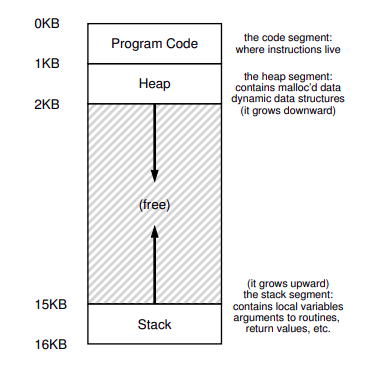

## Resources

- ### [Operating Systems - Three Easy Pieces](https://techiefood4u.files.wordpress.com/2020/02/operating_systems_three_easy_pieces.pdf)

## Introduction to OS

Main objectives of OS include:-

1. **CPU Virtualization** : Making using the processor easy.
2. **Memory Virtualization** : Making storage in memory easy.
3. **Concurrency** : Ensuring correctness when multiple programs run together.
4. **Persistence** : Ensuring permanent memory does not get erased and stays organised.
5. **Design Goals** : Abstractions, performance, isolation, reliability, energy-efficiency

## CPU Virtualization

### Abstraction : Process

The abstraction provided by the OS of a running program is called a ***process***.

The OS creates the illusion of **virtualization** the CPU by running one process, then stopping it and running another, and so forth. This is known as **time sharing** of the CPU.

> **Time sharing** is one of the most basic techniques used by an OS to share a resource. By allowing the resource to be used for a little while by one entity, and then a little while by another, and so forth. The natural counterpart of time sharing is **space sharing**, where a resource is divided (in space) among those who wish to use it.

#### Process API

- **Create**: Spawns a new process.
- **Destroy**: Kills a process forcefully.
- **Wait**: Wait for a process to finish.
- **Status**: Every process has a state associated with it.
- **Miscellaneous Control**: Halt, resume, etc.

#### Process Creation

1. Loading the *code* into executable format.
2. Initializing the process's runtime *stack*.
3. Initializing the program's *heap* memory.
4. Setup *file descriptors* associated with *input*, *output* and *error* streams.

#### Process States

Following are the types of states a process can be in:-
- **Running**
- **Ready**
- **Blocked**

```goat
 .-------.  Descheduled  .-----.
| Running |------------>| Ready |
|  state  |<------------| state |
 '-------'   Scheduled   '-----'
      \                     /
  I/O: \                   / I/O:
  start \    .-------.    /  done
         +->| Blocked |<-+
            |  state  |
             '-------'
```

#### Data Structures

- **Process List**: A list maintained by the OS of all the processes and their PCB.
- **Process Control Block** (PCB): A C struct that keeps track of all the meta-data associated with one process.

#### Process API in Linux

In UNIX systems new processes are created with the use of 2 system calls `fork()` and `exec()`.

#### `fork()` system call

```c
int main(){
    printf("%d:hello world.",getpid());
    int rc = fork();
    if (rc<0) {
        // fork failed
        fprintf(stderr, "fork failed\n");
    } else if (rc == 0) {
        // only executed by child
        printf("%d:hello, I am child.\n",getpid());
    } else {
        // only executed by parent
        printf("%d:hello, I am parent of %d.\n", getpid(), rc);
    }
    return 0;
}
```

#### Adding `wait()` system call

```c
int main(){
    printf("%d:hello world.",getpid());
    int rc = fork();
    if (rc<0) {
        // fork failed
        fprintf(stderr, "fork failed\n");
    } else if (rc == 0) {
        // only executed by child
        printf("%d:hello, I am child.\n",getpid());
    } else {
        // only executed by parent
        // after waiting for child
        while(wait(NULL)>0);
        printf("%d:hello, I am parent of %d.\n", getpid(), rc);
    }
    return 0;
}
```

#### Finally, the `exec()` system call

```c
int main(){
    printf("%d:hello world.",getpid());
    int rc = fork();
    if (rc<0) {
        // fork failed
        fprintf(stderr, "fork failed\n");
    } else if (rc == 0) {
        // only executed by child
        printf("%d:hello, I am child.\n",getpid());
        char *myargs[3];
        myargs[0] = strdup("wc");
        myargs[1] = strdup("p3.c");
        myargs[2] = NULL;
        execvp(myargs[0], myargs);
        // Child converted to a different program now
        printf("somethings wrong; I can feel it\n");
    } else {
        // only executed by parent
        // after waiting for child
        while(wait(NULL)>0);
        printf("%d:hello, I am parent of %d.\n", getpid(), rc);
    }
    return 0;
}
```

### Limited Direct Execution

Direct Execution can be explained by the following table,

| OS                            | Program                      |
| ----------------------------- | ---------------------------- |
| Create entry for process list |                              |
| Allocate memory to program    |                              |
| Load program into memory      |                              |
| Set up stack with argc/argv   |                              |
| Clear registers               |                              |
| Execute call `main()`         |                              |
|                               | Run `main()`                 |
|                               | Execute return from `main()` |
| Free memory of process        |                              |
| Remove from process list      |                              |

#### Problem \#1: Restricted Operations

> How to perform restricted operations such as I/O or networking without giveing complete control over the system?

We add processor modes:-
- ***User mode***: The code that runs here is restricted and can't issue I/O requests and it will kill the process.
- ***Kernel mode***: In this mode the operating system runs the code and can do whatever it likes.

> What should a user program do to perform some kind of privileged operation?
 
The answer is ***system calls***.

Every system call runs a special `trap` instruction which jumps the execution to kernel mode to do any privileged operation. Once finished the program can return to user mode by executing `return-from-trap` instruction.

While executing `trap`, the hardware needs to ensure the register state of the user program is stored and must be restored when `return-from-trap` is executed.

> How does the trap know which code to run inside the OS?

The kernel sets-up a **trap table** at boot time in priviledged mode. OS informs the hardware of the locations of the **trap handlers**. Using this, whenever a hardware interrupt is 
passed this code is run by the hardware from the trap handlers.
All these operation are also **priviledge** operations.

| OS                            | Hardware                                      | Program                     |
| ----------------------------- | --------------------------------------------- | --------------------------- |
| Initialize trap table         | Remember addresses of syscall handler         |                             |
| ----------------------------- | --------------------------------------------- | --------------------------- |
| Create entry for process list |                                               |                             |
| Allocate memory to program    |                                               |                             |
| Load program into memory      |                                               |                             |
| Set up stack with argc/argv   |                                               |                             |
| Clear registers               |                                               |                             |
| `return-from-trap`            |                                               |                             |
|                               | restores regs to kernel stack                 |                             |
|                               | move to user mode                             |                             |
|                               | jump to `main()`                              |                             |
|                               |                                               | Run `main()`                |
|                               |                                               | Call syscall                |
|                               |                                               | `trap` into OS              |
|                               | save regs to kernel stack                     |                             |
|                               | move to kernel mode                           |                             |
|                               | jump to trap handler                          |                             |
| Handle trap                   |                                               |                             |
| Execute system call           |                                               |                             |
| `return-from-trap`            |                                               |                             |
|                               | restore regs from kernel stack                |                             |
|                               | move to kernel mode                           |                             |
|                               | jump to PC after trap                         |                             |
|                               |                                               | return from main            |
|                               |                                               | `trap` via `exit()`         |
| Free memory of process        |                                               |                             |
| Remove from process list      |                                               |                             |


#### Switching Between Process

> How can the operating system **regain control** of the CPU so that it can switch process?

- ***Wait for system calls***: When ever the user program makes system call or makes an error it returns the control back to the OS. Otherwise it can also make a `yield` call to return the control to the OS periodically.
- ***OS takes controls***: This can be done using a simple `timer interrupt` that is raised after a fixed amount milliseconds.

#### Saving and Restoring Context

> Once the OS gains control, how to decide which process gets executed next?

This is done by the **scheduler**. Once the decision is made the OS executes a low-level piece of code which is called **context switch**. It is basically saving the register values of the current process and restoring the same for the next process.

### Scheduling

#### Workload Assumptions

1. Each job runs for the same amount of time.
2. All jobs arrive at the same time.
3. All jobs only use the CPU.
4. The run-time of each job is known.

#### Scheduling Metrics

We first define a performance index,
$$
    T_{turnaround} = T_{completion} - T_{arrival}
$$
For now, $T_{turnaround} = T_{completion}$.

Another metric that we need to keep track of is fairness.

> Jain's Fairness Index?

#### First In First Out

This works and produces least turnaround time with current assumptions.

I assumption 1 is removed, then this stops giving the most optimum solution.

#### Shortest Job First

This produces the best results without assumption 1.

If assumption 2 is also removed then in some cases this method performs poorly.

#### Shortest Time-to-Completion First

With only assumptions 3 and 4 this is the theoretically most optimum solution. This can be easily implemented using a heap. It also makes use of timed interrupts and context switching.

In modern systems another new metric is quite important called **Response time**.
$$
    T_{response} = T_{firstrun}-T_{arrival}
$$
STCF doesn't necessarily perform well in this case.

#### Round Robin

Aka **time slicing**, in this method a time slice is fixed and after every such time period an interrupt is passed. After an interrupt the OS makes sure to rotate between different processes to ensure low response time and fairness.

#### Incorporating I/O

This relaxes the 3rd assumption and whenever a process is engaged in I/O operation it is *blocked*. At it's place a different process is allowed to use the CPU.

#### Multi-Level Feedback Queues

1. If Priority(A) > Priority(B), A runs (B doesn’t).
2. If Priority(A) = Priority(B), A & B run in RR.
3. When a job enters the system, it is placed at the highest
priority (the topmost queue).
4. Once a job uses up its time allotment at a given level (regardless of how many times it has given up the CPU), its priority is
reduced (i.e., it moves down one queue).
5. After some time period S, move all the jobs in the system
to the topmost queue.

## Memory Virtualization

### Abstraction : Address Spaces



3 regions of code in the address space:-
- Code: Keeps the data related to the code
- Stack: Keeps track of the function calls and scope variables
- Heap: Holds the dynamically allocated memory

Objectives of Memory virtualization:-
- Transparency
- Efficiency
- Protection/Isolation

### Memory API

#### Automatic/Stack Memory

This is the memory that is accessed when using a variable on **stack**. This is temporary and is overwritten when the variable goes out of scope

```c
void func() {
    int x; // declares an integer on the stack
    ...
}
```

#### Heap Memory

This is a long-lived memory which is handled explicitly by the programmer.

```c
void func() {
    int *x = (int *) malloc(sizeof(int)); // allocates memory on heap
    ...
    free(x); // frees the allocated memory
}
```
> `malloc()` and `free()` are not system calls but library calls built on top of system calls. Apart from these there is `calloc()` and `realloc()`.

> `mmap()` is another call to get **anonymous** memory allocated in the swap space.

### Address Translation

The hardware provides a generic technique called **hardware-based address translation** to map virtual addresses to physical address but this is quite low-level and the OS has to step-in and manage which areas are free.

We assume that:
- Address space must be mapped to *contiguous* physical memory
- The physical space is large compared to the address space
- All address spaces are of exactly same size

This is done at runtime by the **Memory Management Unit(MMU)** in the CPU. The hardware maintains a **base** and a **bound** to keep track of where an address space is mapped. If memory outside this is accessed CPU raises a segmentation fault.

OS thus has to maintain the location of memory not in use in a data structure such as **free list**.

### Segmentation

Instead of keeping track of base and bound pair of the entire address space as this wastes a lot of used space, store base and bound of different segments such as the code, stack and heap. Along with their seperate bounds also keep track of direction in which it grows and it's read/write permissions.

#### OS issues

1. ***Context Switch***: During a context switch the OS needs to make sure the addresses corresponding to all the segments of the address space are stored.
2. ***External Fragmentation***: This happens when the spaces left in between allocated segments is not enough to store a new segment but the total free space is sufficient to do so.

### Free Space Management

#### Free List Approach

Using a linked list to keep track of free unallocated segments of memory. Every node stores the start and size of the free segment. When new segements are to be allocated find a node with enough space and shrink it to account for newly occupied memory. Later when a segment is freed, collase joined node together.

#### Some allocation strategies

- Best fit: node with min size greater than required.
- Worst fit: node with max size greater than required. Basically largest node.
- First fit: first node greater than required. Greedy but fast.
- Next fit: Instead of searching from the start search from the next node of last allocation.

#### Other Approaches

- Segregated Allocator: Keeps a region of memory to allocate the most segments with the most frequent size and a separate block to keep segments with other sizes.
- Buddy Allocator: Only divides free segments in half. Simplifies the coallesing part.

### Paging : Intro

Memory is divided in terms of ***pages*** with fixed sizes. Thus every address space is given a fixed amount of pages.

#### Address Translation

Every address can be broken into 2 parts: Virtual page number and the byte offset.

> For example, for a 64-byte address space i.e. 6-bit addresses and 16 byte page-size we get the 2-bit VPN and 4-bit offset.

For a typical 32-bit address space with 4KB pages, the address is split into 20-bit VPN and 12-bit offset. This means $2^{20}$ VPN to PPN translation that the **Page Table** will have to hold. This means for 4 bytes per **Page table entry** a huge 4MB per process (400MB for 100 such processes). Thus the PgTable is stored in the memory somewhere.

#### Page Table entry

- **Valid bit**: Valid VPN or not.
- **Protection bits**: R/W permissions
- **Present bit**: Whether present in memory or not.
- **Dirty bit**: The page has been modified or not.
- **Reference bit**: Tracks whether a page has been accessed.

#### Problems with Paging

1. Too slow: The page table is stored in memory so for each memory access, 2 memory accesses are needed.
2. Too large: The total size of the Page Table is so large it needs to be stored in the memory.

### Paging : Faster Translations

