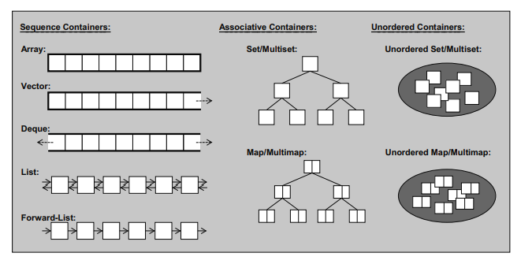

## Basic Utilities

### Initializer lists

```cpp
int values[] {1, 2, 3};
std::vector<int> v {1, 2, 4, 8, 16};
std::vector<std::string> cities {
    "Berlin", "New York", "London", "Braunschweig", "Cairo", "Cologne"
};
std::complex<double> c{4.0,3.0}; // equivalent to c(4.0,3.0)
```

### Range-based *for* loops

- Looping through a container
    ```cpp
    for (auto& elem : vec) {
        elem *= 3;
    }
    ```
- Looping through an initializer list
    ```cpp
    for (int i : {1, 2, 3, 4, 5}) {
        std::cout<< i << std::endl;
    }
    ```

### Lambda functions

```cpp
int x=0;
int y=42;
auto f1 = [=, &y] (std::string s) {
    cout<<s<<"\n";
    x++; // not very effective
    y++; // super effective
}
auto f2 = [=] (std::string s) {
    cout<<s<<"\n";
    x++; // not very effective
    y++; // not very effective
}
auto f3 = [&] (std::string s) {
    cout<<s<<"\n";
    x++; // super effective
    y++; // super effective
}
```

### Numeric Limits

```cpp
cout << "max(short): " << numeric_limits<short>::max() << endl;
cout << "max(int): " << numeric_limits<int>::max() << endl;
cout << "max(long): " << numeric_limits<long>::max() << endl;
```

### Pair

```cpp
std::pair<T1, T2> p(e1,e2);
```

| Operation          | Effect                                                   | Complexity       |
| ------------------ | -------------------------------------------------------- | ---------------- |
| `make_pair(e1,e2)` | Returns a pair using types and values of e1 and e2       | $\mathcal{O}(1)$ |
| `p.first`          | Returns reference to first value                         | $\mathcal{O}(1)$ |
| `p.second`         | Returns reference to second value                        | $\mathcal{O}(1)$ |
| `p1==p2`           | Returns `p1.first==p2.first && p1.second==p2.second`     | $\mathcal{O}(1)$ |
| `p1<p2`            | Compares first values and if equal second of both values | $\mathcal{O}(1)$ |
| `swap(p1,p2)`      | Swaps data of p1 and p2                                  | $\mathcal{O}(1)$ |

### Tuple

```cpp
std::tuple<T1,T2,T3,...Tk> t(e1,e2,e3,...,ek);
```

| Operation                   | Effect                                                | Complexity       |
| --------------------------- | ----------------------------------------------------- | ---------------- |
| `make_tuple(e1,e2,..., ek)` | Returns a tuple using types and values of e1, ..., ek | $\mathcal{O}(k)$ |
| `get<i>(t)`                 | Returns reference to the ith value                    | $\mathcal{O}(1)$ |
| `t1==t2`                    | Returns whether all elements of t1 are equal to t2    | $\mathcal{O}(k)$ |
| `t1<t2`                     | Compares elements of t1 and t2 lexicographically      | $\mathcal{O}(k)$ |
| `swap(t1,t2)`               | Swaps data of t1 and t2                               | $\mathcal{O}(k)$ |

## STL Structure

STL has 4 most important design components; containers, iterators, algorithms and function objects. These can be used to separate data structures from algorithms and provides a generic API for combining the two.

### Containers

There are 3 kinds of containers:

#### Sequence containers 

These are *ordered collections* where every element has a certain position. These containers are usually implemented using *arrays* or *linked lists*.

1. **Vector**: Vector manages it's elements in the form of a dynamic array that can grow in one direction with random access.
2. **Deque**: It is a dynamic array that can grow in both directions.
3. **Array**: A container of fixed size with random access.
4. **List**: It is a doubly linked list of elements with insertion or deletion at any position.
5. **Forward List**: It is a singly linked list without backward operations of List.

#### Associative containers

These are *sorted collections* where the position of every element depends on its value. These containers are usually implemented using *binary trees*.

1. **Set**: A set is a collection in which elements are sorted according to their own values. Each element may occur only once, so duplicates are not allowed.
2. **Multiset**: A multiset is the same as a set except that duplicates are allowed. Thus, a multiset may contain multiple elements that have the same value.
3. **Map**: A map contains elements that are key/value pairs. Each element has a key that is the basis for the sorting criterion and a value. Each key may occur only once, so duplicate keys are not allowed. A map can also be used as an associative array, an array that has an arbitrary index type.
4. **Multimap**: A multimap is the same as a map except that duplicates are allowed. Thus, a multimap may contain multiple elements that have the same key. A multimap can also be used as dictionary.

#### Unordered (associative) containers 

These are *unordered collections* where the position of an element doesn't matter. These containers are usually implemented using *hash tables*.

1. **Unordered set**: An unordered set is a collection of unordered elements, where each element may occur only once. Thus, duplicates are not allowed.
2. **Unordered multisets**: An unordered multiset is the same as an unordered set except that duplicates are allowed. Thus, an unordered multiset may contain multiple elements that have the same value.
3. **Unordered map**: An unordered map contains elements that are key/value pairs. Each key may occur only once, so duplicate keys are not allowed. An unordered map can also be used as an associative array, an array that has an arbitrary index type.
4. **Unordered multimap**: An unordered multimap is the same as an unordered map except that duplicates are allowed. Thus, an unordered multimap may contain multiple elements that have the same key. An unordered multimap can also be used as dictionary.

#### Container Adapters

1. **Stack**: A stack (the name says it all) manages its elements by the LIFO (last-in-first-out) policy.
2. **Queue**: A queue manages its elements by the FIFO (first-in-first-out) policy. That is, it is an ordinary buffer.
3. **Priority queue**: A priority queue is a container in which the elements may have different priorities.

### Iterators

We need a concept of an object that represents positions of elements in a container. Objects that fulfill this concept are called ***iterators***. Following are the operations that one can perform using these iterators:

- Operator `*` returns the element of the current position. If the elements have members, you can use operator `->` to access those members directly from the iterator.
- Operator `++` lets the iterator step forward to the next element. Most iterators also allow stepping backward by using operator `--`.
- Operators `==` and `!=` return whether two iterators represent the same position.
- Operator `=` assigns an iterator.

Apart from this every container class also provides following methods:
- `begin()` returns an iterator that represents the beginning of the elements in the container. The beginning is the position of the first element, if any.
- `end()` returns an iterator that represents the end of the elements in the container. The end is the
position behind the last element. Such an iterator is also called a past-the-end iterator.

Types of iterators:-
1. **Forward Iterators**: Support only `++` operator. Used in `forward_list`, `unordered_set`, `unordered_multiset`, `unordered_map` and `unordered_multimap`.
2. **Bidirectional Iterators**: Support `++` and `--` operators. Used in `list`, `set`, `map`, `multiset` and `multimap`.
3. **Random-access Iterators**: Support iterator arithmetic (`+,-,>,<,`etc). Used in `vector`, `array`, `deque` and `string`.

### Algorithm

### Function object

## STL Containers



### Arrays

Array
: An ***array*** is a sequence of elements with constant size.
   - Ordered collection
   - Random access

#### Array provides $\mathcal O(1)$ element access.
This is done by using iterator arithmetic to get to any element's location.

### Vectors

Vector
: A ***vector*** models a dynamic array that can grow in one direction.
    - Ordered collection
    - Random access
    - Dynamic storage