## Image Quilting

Image Quilting is a texture synthesis and transfer algorithm developed by Alexei A. Efros and William T. Freeman, presented in their influential paper in 2001. This algorithm provides a method for generating larger textures from smaller sample textures while maintaining visual coherence and avoiding visible seams.

1. **Patch Selection**

The algorithm starts by selecting overlapping patches from the input texture. These patches serve as the building blocks for the synthesis process.

Best possible patch-size that will produce most seamless results can vary a lot between different textures as this depends on reeccuring qualities within each texture. Therefore we have tried sampling patches with many sizes ranging from 18 to 54 in multiples of 6.

In some case like the text-based texture given below the patches can also be restricted along an axis. This improves the output quality and also reduces computing time.

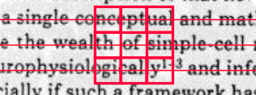

2. **Matching and Stitching**

Image Quilting employs a matching criterion to find the most suitable patches for stitching. This criterion considers the similarity between the overlapping regions of candidate patches.

The selected patches are then stitched together to create a larger texture. The algorithm pays attention to minimizing the appearance of seams by carefully aligning and blending the patches.

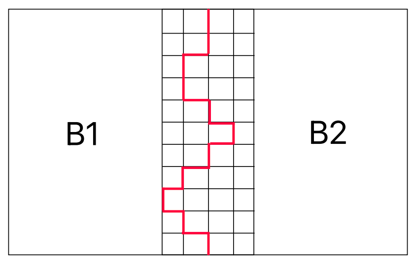

For example in the above figure, there are 2 patches B1 and B2 which have an overlapping region as shown. Keeping B1 fixed, to find the minimum error cut in the overlapping region, the following error is minimized.
$$
  E = \min_{X,b_2}\sum_{j=1}^{\text{N}} (\\ B_1[j,X(j)] - b_2[j,X(j)]\\ )^2
$$
Here $X$ are possible growing cuts in the overlapping region and $N$ is the patch-size. The best cut for a patch $b_2$ is found using dynamic programming.

3. **Overlapping and Randomization**

Overlapping patches contribute to the algorithm's ability to generate coherent textures. This overlap ensures a smooth transition between adjacent patches. As the paper suggests, the overlapping region's 1 sided width is taken to be $1/6^{\text{th}}$ of the patch-size.

Randomization is introduced in the patch selection process to avoid repetitive patterns and to add diversity to the synthesized texture. A threshold value of error that 1.3 times minimum possible error is set. The final $B_2$ is chosen randomly from all $b_2$'s with min-cut error less that this threshold.

## Synthesis

For the texture synthesis task the base image quilting algorithm is applied repeatedly. First the top-left corner is chosen from the possible patches. All other patches are determined from the patches adjacent to them. At worst, a patch might need to optimize over 2 boundaries, for patches above and towards left.

### Results

<!-- |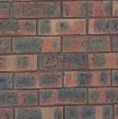 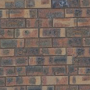|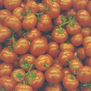 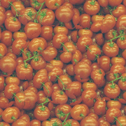| -->

|  |  |
|---|---|
|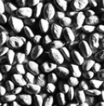 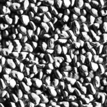 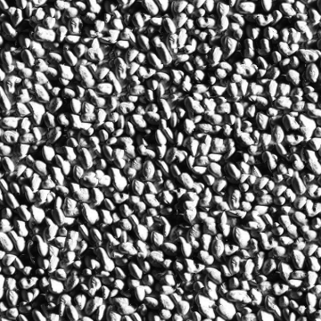|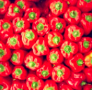 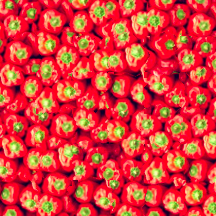 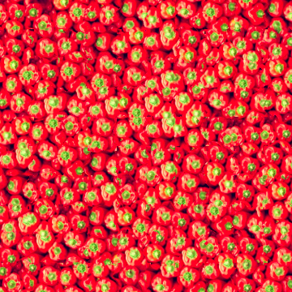|
| 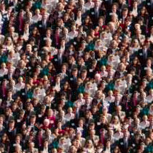 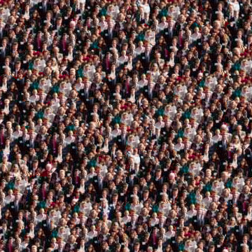|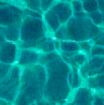 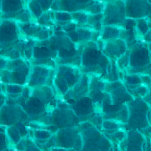 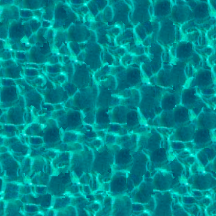|
|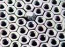 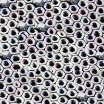|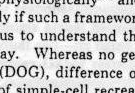 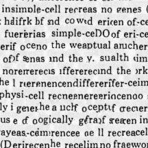|
| | |

## Transfer

For texture transfer onto a target image, the base algorithm is slightly modified. Specifically the error term now includes the difference between the new patch and the corresponding patch from the target image. This difference is simply the euclidean norm between the values from the 2 images. There is parameter $\alpha$ that is used to control the contribution of the 2 error terms.

### Results

| Texture | Target | Output |
|---|---|---|
|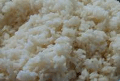|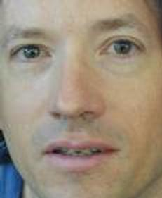|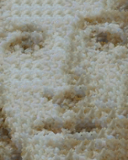|
|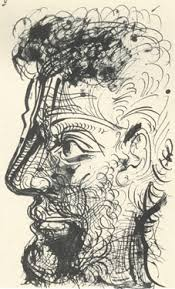|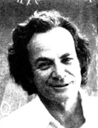|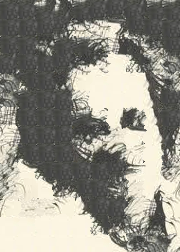|